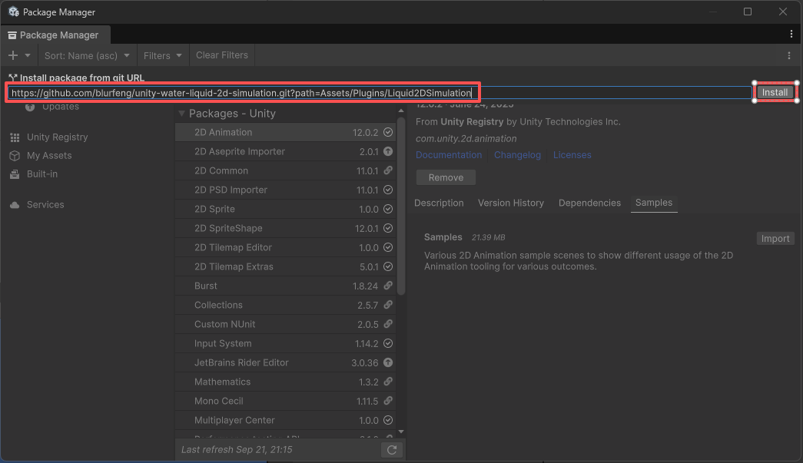
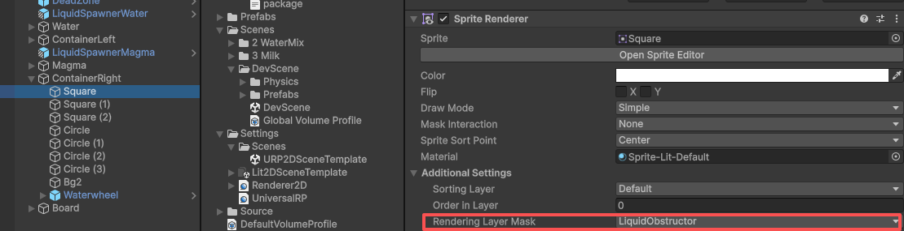
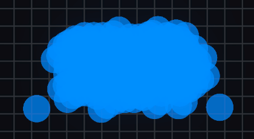
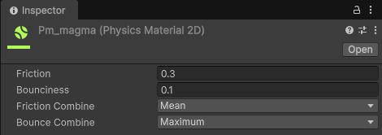

# Liquid 2D Simulation - 2D流体模拟

Liquid 2D Simulation 是一款用于 Unity 的2D流体模拟系统。\
Liquid 2D Simulation is a 2D fluid simulation system designed for Unity.\
Liquid 2D Simulation は、Unity 向けに設計された 2D 流体シミュレーションシステムです。


## 🌍 语言/Language/言語
- ***阅读中文文档 > [中文](README.md)***
- ***Read this document in > [English](README_en.md)***
- ***日本語のドキュメントを読む > [日本語](README_ja.md)***


## 📜 目录

- [简介](#简介)
  - [项目特性](#项目特性)
- [💻 环境要求](#-环境要求)
- [🌳 分支](#-分支)
- [🌱 快速开始](#-快速开始)
  - [1.安装插件](#1安装插件)
  - [2.配置 Rendering Layer](#2配置-rendering-layer)
  - [3.添加 Renderer Feature](#3添加-renderer-feature)
  - [4.创建流体粒子预制体](#4创建流体粒子预制体)
  - [5.创建粒子生成器](#5创建粒子生成器)
- [Renderer Feature 设置指南](#renderer-feature-设置指南)
  - [Cover Color 覆盖颜色](#cover-color-覆盖颜色)
  - [Opacity 不透明度](#opacity-不透明度)
  - [BLur 模糊](#blur-模糊)
  - [Distort 扭曲](#distort-扭曲)
  - [Edge 边缘](#edge-边缘)
  - [Pixel 像素化](#pixel-像素化)
- [流体粒子设置指南](#流体粒子设置指南)
  - [Sprite 贴图](#sprite-贴图)
  - [Collider](#collider)
  - [Rigidbody 2D 刚体](#rigidbody-2d-刚体)
- [粒子生成器设置指南](#粒子生成器设置指南)
  - [控制喷射](#控制喷射)
- [待办事项列表](#待办事项列表)


## 简介
使用本流体粒子系统，你可以快速实现2D流体的模拟，包括水、岩浆、石油等不同质感的流体。\
项目通过流体粒子模拟2D流体效果，并且支持高效地生成大量的粒子，可以用于移动平台。但过多的刚体仍然是一个性能问题。\
通过使用 `Render Graph` 框架，只需一个主相机，并通过 `GPU Instance` 方式渲染流体粒子。\
与传统的单独相机渲染到 Render Target 的方式相比，渲染效率大幅提升。\
渲染方式类似 SDF 的融合效果，表现出流体的自然效果。\
实际过程中，通过粒子纹理的透明度叠加和裁剪实现粒子融合效果。相比于严格的 SDF 方法，这种方式在性能和效果上达到了更好的平衡，并且不会随着粒子数量的增加而降低性能。\


### 项目特性
| 项目特性                           | 描述                                                                                         |
| --------------------------------- | -------------------------------------------------------------------------------------------- |
| URP2D                             | 基于 URP2D 的项目。                                                                           |
| Render Graph                      | 使用新的 Render Graph 框架进行渲染，性能大幅提升。                                              |
| GPU Instance                      | 使用 GPU Instance 方式渲染粒子，可以一次渲染大量粒子，支持更多粒子数量。                          |
| Volume 运行时修改                  | 支持在运行时通过 Volume 修改流体粒子的渲染效果。                                                |
| 物理粒子模拟                       | 通过刚体模拟流体粒子的物理效果，使表现更自然。                                                   |


## 💻 环境要求
- Unity6000.2 或更新的版本。（或者使用Unity2022.3的分支版本）
- URP2D 渲染管线。
- 使用 Renderer Graph 框架进行渲染。
- 与着色器兼容的平台。


## 🌳 分支
- **main** - 主分支，基于 Unity 6 版本。
- **2022.3** - Unity 2022.3 版本分支。如果你需要在更旧的版本上使用此系统，可以查看此分支。更新会慢于主分支。


## 🌱 快速开始
按你喜欢的方式安装插件，然后你可以直接查看演示场景学习如何使用此系统。\
或者，按以下步骤一步步操作。
### 1.安装插件
#### 使用 UPM
```
https://github.com/blurfeng/unity-water-liquid-2d-simulation.git?path=Assets/Plugins/Liquid2DSimulation
```
通过 UPM 安装插件到你的项目。如果你需要演示场景，使用下面的方式导入。
1. 打开 `Window -> Package Manager`。\


2. 点击左上角的 `+` 号，选择 `Install package from git URL...`。\


3. 粘贴上面的 URL，点击 `Install` 按钮。\


4. 等待安装完成后，你会在 `Packages` 里看到 `Liquid2DSimulation` 包。你可以导入 Samples 文件夹来查看演示场景。\


5. 导入 Samples 文件夹后，你可以在 `Assets/Samples/Liquid 2D Simulation/./Samples` 目录下看到演示场景。\


#### package
使用安装包将插件安装到你的项目中。
在 [Releases](https://github.com/blurfeng/unity-water-liquid-2d-simulation/releases) 页面下载最新的安装包。\
然后将包导入到你的项目中。\
插件包含了 Samples 文件夹，里面有演示场景。你可以直接从这里开始学习如何使用此系统。\


### 2.配置 Rendering Layer
在 Liquid Feature 中使用了 Rendering Layer 来区分哪些可以阻挡流体粒子的物体，比如挡板、管道、容器、地形等。\
你需要在 Obstruction Rendering Layer Mask 中配置用于阻挡的层级，并且给对象也配置相同的层级。\
否则，你会发现流体粒子会覆盖在这些对象的上面，因为流体粒子的渲染顺序是 RenderPassEvent.AfterRenderingTransparents。


但是在演示场景中，你会发现阻挡物很好地阻挡了流体粒子。这是因为原本已经配置了正确的 Rendering Layer Mask。\
因为引擎的缓存和机制，它们依旧能够正常工作。但是在你的项目中，这些 Rendering Layer 实际上并不存在。\
在演示场景的 Liquid2DRenderer2D 的 Liquid2DFeature 上，Obstruction Rendering Layer Mask 配置显示为 `Unnamed Layer 1`。\


在场景的阻挡物的 Sprite Renderer 上，Additional Settings 的 Rendering Layer Mask 被配置为 `Everything`。\


#### 添加阻挡层 Rendering Layer
1. 打开 `Edit -> Project Settings -> Tags and Layers`。
2. 在 `Rendering Layers` 中添加一个新的层，比如 `LiquidObstruction`。

3. 在你的阻挡物的 Sprite Renderer 组件中，找到 `Additional Settings -> Rendering Layer Mask`，并选择你刚刚创建的 `LiquidObstruction` 层。
4. 在 Liquid2DRenderer2D 的 Liquid2DFeature 上，找到 `Obstruction Rendering Layer Mask`，并选择你刚刚创建的 `LiquidObstruction` 层。

这样，流体粒子就会正确地被阻挡物遮挡。

### 3.添加 Renderer Feature
演示场景中已经添加好了 Renderer Feature。\
如果你想在自己的场景中使用此系统，你需要在当前的 Renderer 2D Data 中添加 Liquid2D Feature。\


### 4.创建流体粒子预制体
你可以从 `./Liquid2DSimulation/Runtime/Resources/Prefabs/` 目录下找到流体粒子预制体 `Liquid2DParticle`。\
建议你从这个预制体创建一个变体预制体，然后修改材质和参数来创建你想要的流体粒子。\
你也可以直接自己创建一个流体粒子预制体，然后添加 `Liquid2DParticle` 组件、`Circle Collider 2D` 组件和 `Rigidbody 2D` 组件。\


你需要配置 `Liquid2DParticle` 组件的参数来调整流体粒子的行为。包括 Sprite 纹理，材质，颜色和流体层等等。\
在插件的 `./Liquid2DSimulation/Runtime/Resources/Materials/` 和 `./Liquid2DSimulation/Runtime/Resources/Textures` 目录下提供了材质和纹理，你可以直接使用。

### 5.创建粒子生成器
你可以从 `./Liquid2DSimulation/Runtime/Resources/Prefabs/` 目录下找到粒子生成器预制体 `LiquidSpawner`。\
建议你从这个预制体创建一个变体预制体，然后修改参数来创建你想要的粒子生成器。\
你也可以直接自己创建一个粒子生成器预制体，然后添加 `Liquid2DSpawner` 组件。\


## Renderer Feature 设置指南
Renderer Feature 用于渲染流体粒子，并最终实现流体效果。\
以下主要讲解重要的特性或参数，更详细的参数可以直接查看 Inspector 面板的 Tooltip。

### Cover Color 覆盖颜色
如果你设置了 `Cover Color`，并且这个颜色的透明度为1（这里透明度代表覆盖强度），那么这个颜色将完全覆盖原有的颜色。

### Opacity 不透明度
通过设置 `Opacity Mode` 和 `Opacity Value` 参数，你可以控制流体的整体不透明度。\
Default 模式不会改变粒子本身的透明度。模糊后看起来内部颜色更加不透明，边缘会更加透明。\
Multiply 模式会将不透明度和粒子本身的透明度相乘。\
Replace 模式会将不透明度直接应用到粒子上。这也会覆盖粒子本身的透明度以及模糊后的透明度。\
使用覆盖颜色和不透明度设置，你可以得到均匀的流体颜色。\


### BLur 模糊
模糊效果可以让粒子间的融合更自然。\
如果你的粒子贴图本身融合效果已经很好，可以关闭模糊来提升性能。\
模糊的迭代次数和偏移量决定模糊的强度。更多的迭代次数和较小的偏移量可以获得更好的模糊效果。\
由于使用模糊的方式而不是 SDF 方式，所以粒子数量不会对性能产生影响。\

#### 关于模糊和背景
因为模糊的原理是对像素进行采样并混合，所以背景的颜色会影响模糊的效果，最终让流体的边缘看起来接近背景颜色。\


可以通过算法减弱这种情况但无法完全消除。因此，提供了 `blurBgColor` 和 `blurBgColorIntensity` 参数来调节边缘的颜色。\
建议使用和粒子整体接近的颜色作为边缘颜色，强度设置为0.5-0.8之间，这样能获得更自然的效果。\
你也可以打开 `ignoreBgColor` 参数来忽略背景颜色的影响（实际上无法完全忽略背景颜色），这会增加一些性能开销。\
如果你设置了 `Cover Color` 并完全覆盖了背景色，就不会有流体粒子边缘融合背景色的情况了，因为粒子本身的颜色和模糊产生的颜色将被完全覆盖。

### Distort 扭曲
通过扭曲效果模拟流体的折射。如果流体是透明的，可以看到背后的画面被扭曲的效果。\
如果流体是不透明的，可以关闭此效果提升性能。\


### Edge 边缘
通过 `Edge Intensity` 和 `Edge Color` 参数，你可以控制流体边缘的颜色和宽度。\
这能够强调流体的边缘，使其更明显，模拟菲涅尔的边缘效果，或者制作发光的边缘。\


### Pixel 像素化
通过开启像素化效果，你可以让流体粒子呈现像素化的效果。\
这可以使流体适用于像素风格的游戏。\

#### PixelBg 像素化背景
像素化背景可以让流体覆盖的区域也呈现像素化效果，使风格更统一。


## 流体粒子设置指南
流体粒子是组成流体的基本单元。\
以下主要讲解重要的特性或参数，更详细的参数可以直接查看 Inspector 面板的 Tooltip。

### Sprite 贴图
为流体粒子配置合适的 Sprite 非常重要，它决定了流体粒子的融合效果，最终决定流体整体的视觉效果。\
贴图的重点在于对透明度的设计。推荐使用类似 SDF 效果的贴图，中心透明度高，边缘透明度低。\
如果你想要更柔和的边缘，可以使用高斯模糊处理贴图。如果你想要更锐利的边缘，可以使用硬边的贴图。
#### 贴图透明度
粒子间透明度的叠加和裁剪是实现粒子融合的关键。\
与模糊效果相配合，可以实现更自然的流体效果。当然如果贴图本身的融合已经很好，也可以关闭模糊效果来提升性能。\
需要注意的是，粒子贴图并不在乎透明范围是否超出了贴图的边界，超出反而能让粒子更早地融合。\
假设你使用一个圆形的贴图，贴图的边界是透明的，那么粒子在接触时会有一段距离才开始融合。\
但假设贴图边界是 0.6 的透明度，那么粒子在接触时就会开始融合。\


### Collider
碰撞器和刚体是实现流体粒子物理效果的关键。建议使用圆形的碰撞器，这能更好地表现流体粒子的物理效果。\
一般碰撞器的尺寸需要小于贴图的尺寸，这样在表现上流体粒子能更好地融合，否则你会看到粒子间的缝隙。\


### Rigidbody 2D 刚体
使用 Unity 的物理系统来模拟流体粒子的物理效果。\
刚体的质量、线性阻力和重力比例等参数都会影响流体粒子的行为。\
你可以通过调整这些参数来模拟不同类型的流体，比如水、岩浆、石油等。\
物理材质也会影响流体粒子的行为。通过调整摩擦力和弹性等参数，可以模拟不同的流体效果。\



## 粒子生成器设置指南
粒子生成器用于生成流体粒子，类似一个水管或喷泉。\
以下主要讲解重要的特性或参数，更详细的参数可以直接查看 Inspector 面板的 Tooltip。

### 控制喷射
通过参数你可以控制喷射粒子的流量和力度。
#### 生成粒子预制体列表
你可以配置多个粒子预制体。每次生成粒子时会根据权重随机选择一个预制体。\


这允许你使用更多不同的粒子来模拟更复杂的流体，比如岩浆。它们通常是不均匀的红色、橙色和黄色的混合粒子。\


关于岩浆的配置技巧，这里我将 `Cutoff` 设置为 0.14，这样流体会保留更多透明度低的部分。\
然后启用 `Distort` 效果。这样你会看到岩浆流体边缘接近透明的部分背景被折射扭曲，类似热气腾腾的效果。\


## 待办事项列表
- **流体粒子**
  - 颜色混合：模拟不同颜色的可相融流体颜色的混合，比如黄色和蓝色混合成绿色。
- **物理系统**
  - 优化：目前在生成大量粒子时，Unity 的物理系统会变得很慢。需要找到更好的解决方案，比如使用 DOTS 物理系统。
  - 流体粒子间的相互物理作用：通过模拟粘性和张力等物理效果，表现不同类型的流体，比如石油、蜂蜜、泡沫等。