<p align="center">
  
  
  
  
</p>

<p align="center">
  🌍
  <a href="./README.md">中文</a> |
  <a href="./README_EN.md">English</a> |
  日本語
</p>

<p align="center">
  📥
  <a href="#upmを使用">インストール</a> |
  <a href="#パッケージをダウンロード">ダウンロード</a>
</p>

# Liquid 2D Simulation - 2D流体シミュレーション
Liquid 2D Simulation は `Unity` 向けの 2D 流体シミュレーションシステムです。すぐに使え、リアルな流体表現を素早く実現できます。  
**自社開発の流体パーティクル物理システム**（SPH デュアル密度ソルバー）を搭載し、**Unity の物理システムに依存しません**。GPU モードでは**数万規模のパーティクル**を簡単に扱いながら、高い効率を維持できます。  
豊富な設定パラメータにより、水・マグマ・石油・泡・砂など、さまざまな質感の流体表現を自由に作成できます。

## 🙏 謝辞
流体物理ソルバーのコアアルゴリズムは主に [SebLague/Fluid-Sim](https://github.com/SebLague/Fluid-Sim) を参考にしました。SebLague に感謝します。

## 📜 目次
- [はじめに](#はじめに)
  - [プロジェクトの特徴](#プロジェクトの特徴)
- [💻 動作環境](#-動作環境)
- [🌳 ブランチ](#-ブランチ)
- [🌱 クイックスタート](#-クイックスタート)
  - [1. プラグインのインストール](#1-プラグインのインストール)
  - [2. Renderer Feature の追加](#2-renderer-feature-の追加)
  - [3. 流体パーティクルディスクリプタの作成](#3-流体パーティクルディスクリプタの作成)
  - [4. パーティクルスポナーの作成](#4-パーティクルスポナーの作成)
- [🌊 Renderer Feature 設定ガイド](#-renderer-feature-設定ガイド)
  - [Rendering Layer の設定](#rendering-layer-の設定)
  - [Cover Color カバーカラー](#cover-color-カバーカラー)
  - [Opacity 不透明度](#opacity-不透明度)
  - [Blur ぼかし](#blur-ぼかし)
  - [Distort 歪み](#distort-歪み)
  - [Edge エッジ](#edge-エッジ)
  - [Pixel ピクセル化](#pixel-ピクセル化)
- [💧 流体パーティクル設定ガイド](#-流体パーティクル設定ガイド)
  - [Sprite テクスチャ](#sprite-テクスチャ)
  - [パーティクルのサイズと描画](#パーティクルのサイズと描画)
  - [Material 物理マテリアル](#material-物理マテリアル)
  - [Mix Colors 色の混合](#mix-colors-色の混合)
- [🧱 シーンの衝突とブロック](#-シーンの衝突とブロック)
  - [Liquid2DCollider コライダー](#liquid2dcollider-コライダー)
  - [コライダーの相互作用モード（Push / Submerge）](#コライダーの相互作用モードpush--submerge)
- [🤝 双方向カップリング（流体 ↔ 剛体）](#-双方向カップリング流体--剛体)
  - [Liquid2DRigidbodyBridge ブリッジコンポーネント](#liquid2drigidbodybridge-ブリッジコンポーネント)
- [🧲 フォースフィールド](#-フォースフィールド)
- [💀 デッドゾーンと境界](#-デッドゾーンと境界)
- [⛲ パーティクルスポナー設定ガイド](#-パーティクルスポナー設定ガイド)
  - [噴射の制御](#噴射の制御)
  - [揺れとパス移動](#揺れとパス移動)
- [🚀 パフォーマンス最適化ガイド（物理）](#-パフォーマンス最適化ガイド物理)
  - [Liquid2DPhysicsConfig コンポーネント](#liquid2dphysicsconfig-コンポーネント)
  - [CPU / GPU ソルブモードの選択](#cpu--gpu-ソルブモードの選択)
  - [パーティクル数と主要なチューニング](#パーティクル数と主要なチューニング)
- [📋 ToDo リスト](#-todo-リスト)


## はじめに
この流体パーティクルシステムを使えば、水・マグマ・石油・泡・砂など、さまざまな質感の 2D 流体を素早くシミュレーションできます。  
本システムは**自社開発の流体パーティクルソルバー**（SPH デュアル密度）を使用し、**Unity の物理システムに依存しません**。パーティクルは純粋なデータであり、パーティクルごとの GameObject を持たないため、大量のパーティクルを効率的にシミュレーションできます。  
ソルブは **CPU / GPU の両モード**に対応します。CPU モードは Job System + Burst をベースとし、GPU モードは Compute Shader を使用してデータを GPU に常駐させ、**数万規模のパーティクル**を簡単に扱いながら高効率を維持できます（実測で約 2 万パーティクルでもエディタモードで 150FPS 前後を維持。テスト機材は下記 [💻 動作環境](#-動作環境) のデバイススクリーンショットを参照）。  
描画面では、`Render Graph` フレームワークによりメインカメラ 1 台だけで済み、`GPU Instance` 方式で流体パーティクルを描画します。従来の専用カメラで Render Target に描画する方式と比べ、描画効率が大幅に向上します。  
描画方式は SDF に似た融合効果を生み出し、流体の自然な表現を実現します。  
実際にはパーティクルテクスチャの透明度の重ね合わせとクリッピングによってパーティクルの融合効果を実現しています。厳密な SDF 方式に比べ、この方式は性能と表現のバランスがより優れており、パーティクル数が増えても性能が低下しません。  
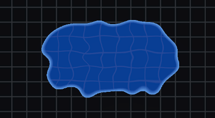

### プロジェクトの特徴
| 特徴                              | 説明                                                                                          |
| --------------------------------- | --------------------------------------------------------------------------------------------- |
| 自社開発の SPH 物理               | 純粋データの SPH デュアル密度ソルバー。Unity 物理に依存せず、パーティクルごとの GameObject も不要で、数万規模でも滑らか。 |
| CPU / GPU 両モード                | CPU は Job System + Burst ベース。GPU は Compute Shader でデータを常駐させ、より大規模に対応。プラットフォーム非対応時は自動で CPU にフォールバック。 |
| 豊富な流体マテリアル              | 粘性・表面張力・摩擦・反発・重力スケール・浮力密度などを設定可能。水 / マグマ / 泡 / 砂のプリセットを内蔵。 |
| シーンインタラクション            | 自社製コライダーによる流体ブロック、双方向の剛体カップリング（押し流し / 浮力による浮遊）、フォースフィールド（吸引 / 反発 / 渦）、デッドゾーンによる回収。 |
| 複数色空間での混色                | 異なる色の流体が出会うと混色。Oklab / RYB / LinearRgb の 3 種類の混色アルゴリズムに対応。       |
| URP 2D / Render Graph             | URP 2D をベースに、新しい Render Graph フレームワークで描画し、性能が大幅に向上。                |
| GPU Instance                      | GPU Instance 方式でパーティクルを描画し、一度に大量のパーティクルを描画でき、より多くのパーティクル数に対応。 |
| Volume による実行時変更           | 実行時に Volume を通じて流体パーティクルの描画効果を変更可能。                                  |

## 💻 動作環境
- `Unity 6000.2` 以降のバージョン
- 2022.3 ブランチは `Unity 2022.3` バージョンに対応しますが、このブランチの更新はメインブランチより遅れます
- URP 2D レンダーパイプライン。Unity 6 バージョンは Render Graph フレームワークで描画します
- シェーダーと互換性のあるプラットフォーム
- GPU ソルブモードはプラットフォームの `Compute Shader` サポートが必要です。非対応時は自動的に CPU モードへフォールバックします

### デバイス
プロジェクト開発に使用する機器の情報。  
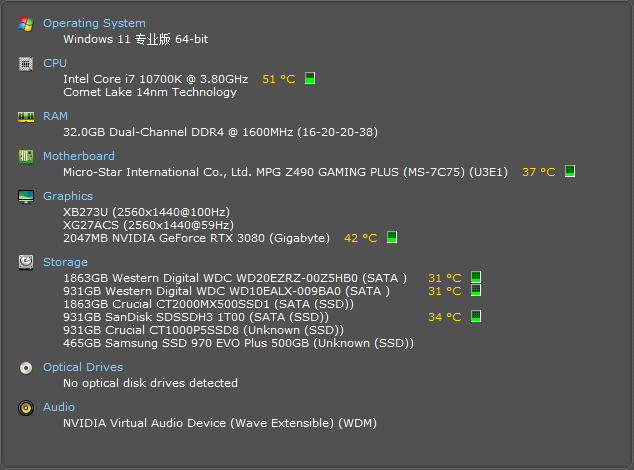

## 🌳 ブランチ
- **main** - メインブランチ。Unity 6 ベース。
- **2022.3** - Unity 2022.3 バージョンのブランチ。より古いバージョンで本システムを使う必要がある場合はこのブランチを参照してください。更新はメインブランチより遅れます。

## 🌱 クイックスタート
お好きな方法でプラグインをインストールしたら、デモシーンを見て本システムの使い方を学べます。  
または、以下の手順を 1 つずつ進めてください。
### 1. プラグインのインストール
#### UPMを使用
```
https://github.com/blurfeng/unity-water-liquid-2d-simulation.git?path=Assets/Plugins/Liquid2DSimulation
```
UPM 経由でプラグインをプロジェクトにインストールします。デモシーンが必要な場合は、以下の方法でインポートしてください。
1. `Window -> Package Manager` を開きます。  
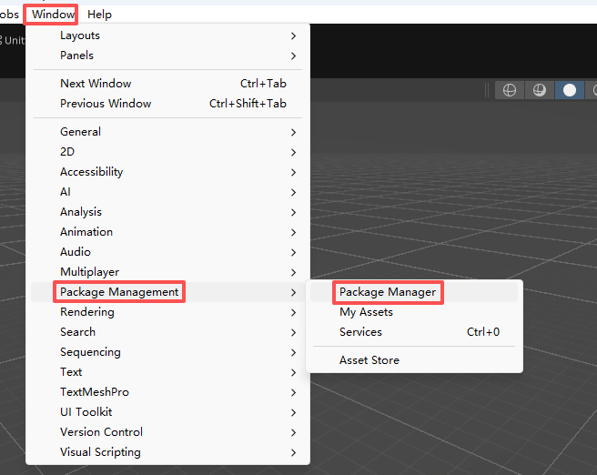

2. 左上の `+` をクリックし、`Install package from git URL...` を選択します。  
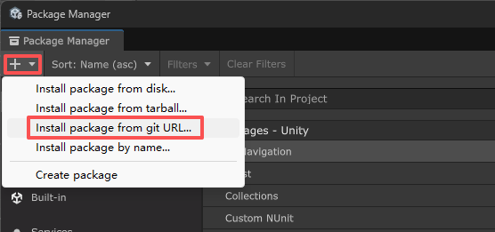

3. 上記の URL を貼り付けて、`Install` ボタンをクリックします。  
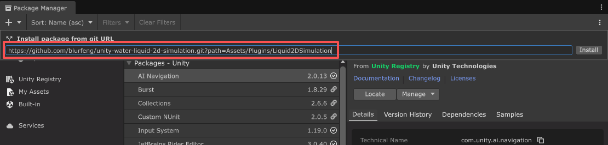

4. インストール完了後、`Packages` 内に `Liquid2DSimulation` パッケージが表示されます。Samples フォルダをインポートしてデモシーンを確認できます。  
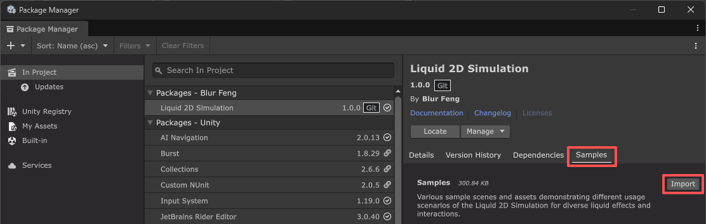

5. Samples フォルダをインポートすると、`Assets/Samples/Liquid 2D Simulation/./Samples` ディレクトリ以下にデモシーンが表示されます。  
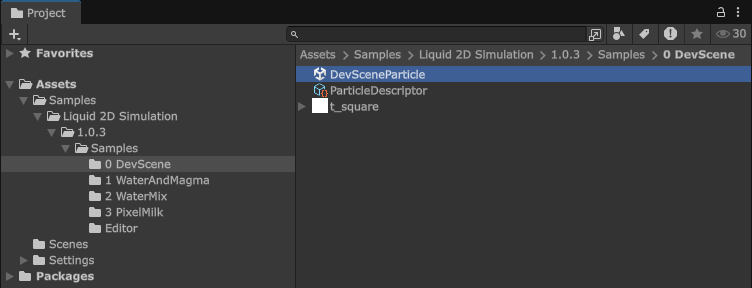

#### パッケージをダウンロード
パッケージを使ってプラグインをプロジェクトにインストールします。  
[Releases](https://github.com/blurfeng/unity-water-liquid-2d-simulation/releases) ページから最新のパッケージをダウンロードします。  
その後、パッケージをプロジェクトにインポートします。

> [!TIP]
> プラグインにはデモシーンが入った Samples フォルダが含まれています。ここから本システムの使い方を学び始められます。  
> または、以下の手順を 1 つずつ進めて、流体パーティクルシステムをシーンに追加してください。  
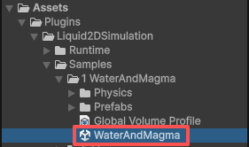

### 2. Renderer Feature の追加
デモシーンでは Renderer Feature がすでに追加されています。  
自分のシーンで本システムを使いたい場合は、現在の Renderer 2D Data に Liquid2D Feature を追加する必要があります。  
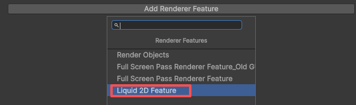

### 3. 流体パーティクルディスクリプタの作成
流体パーティクルは `Liquid2DParticleDescriptor`（`ScriptableObject`）によって定義します。  
`Project` ウィンドウで右クリックし、`Create -> Liquid2D -> Particle Descriptor` を選んでディスクリプタアセットを作成します。  
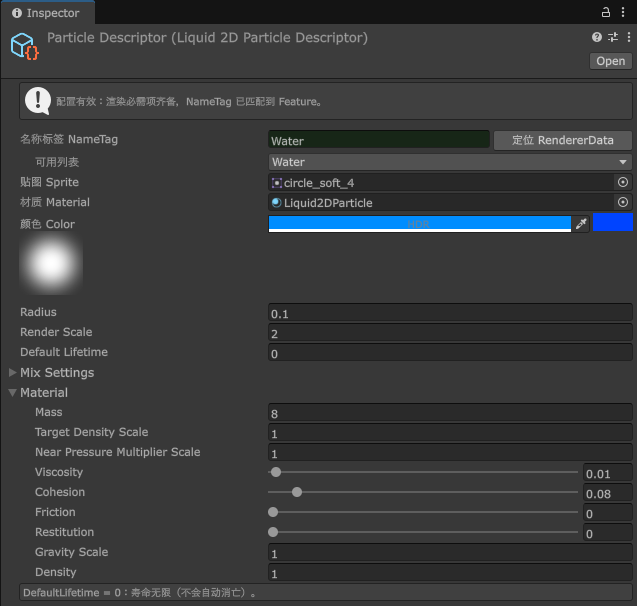

ディスクリプタのパラメータを設定して、流体パーティクルの外観と挙動を定義します。
- `Radius`：パーティクルの物理半径（ワールド単位）。パーティクル間隔と近傍探索範囲を決定します。
- `RenderScale`：描画倍率。描画される表示サイズ = `Radius × 2 × RenderScale`。通常は物理半径よりはるかに大きくして metaball 融合効果を得ます。
- `RenderSettings`：描画設定。`Sprite` テクスチャ、`Material` マテリアル、`Color` カラー（HDR 対応）、`NameTag` ネームタグを含みます。
- `Material`：物理マテリアル。粘性・表面張力・摩擦・反発・重力スケール・浮力密度などを定義します（[Material 物理マテリアル](#material-物理マテリアル) を参照）。
- `MixSettings`：混色設定（[Mix Colors 色の混合](#mix-colors-色の混合) を参照）。

プラグインの `./Liquid2DSimulation/Resources/Materials/` および `./Liquid2DSimulation/Resources/Textures/` ディレクトリにマテリアルとテクスチャが用意されており、そのまま使用できます。

### 4. パーティクルスポナーの作成
パーティクルスポナーは、実行時にディスクリプタを流体パーティクルとして噴射する役割を担います。  
シーンに空のオブジェクトを作成し、`Liquid 2D/Gameplay/Liquid 2D Spawner` コンポーネント（`Liquid2DSpawner`）を追加します。  
プラグインの `./Liquid2DSimulation/Resources/Prefabs/` ディレクトリにある `Liquid2DSpawner` プレハブ（UPM 経由のインストール時は `Packages/Liquid 2D Simulation/Resources/Prefabs/` にあります）を直接使うこともできます。これからバリアントを作成してパラメータを変更することをおすすめします。  
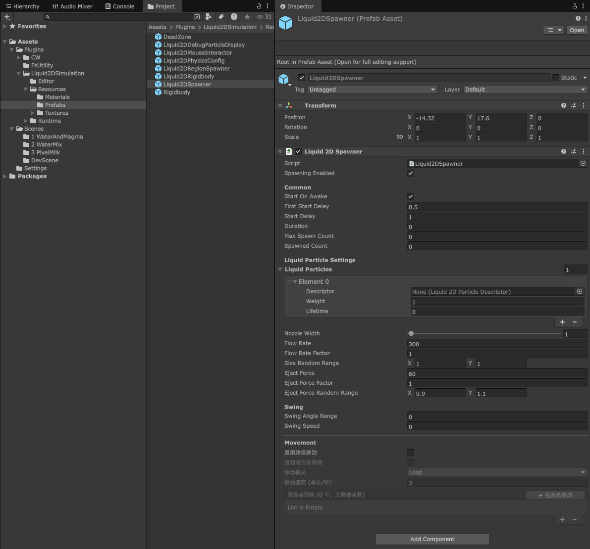

`Liquid2DSpawner` の `Liquid Particles` リストに 1 つ以上の `Liquid2DParticleConfig` を追加します。各項目は**ディスクリプタ**を参照し、**ウェイト**と**ライフタイム**を設定できます。生成時にはウェイトに応じてディスクリプタがランダムに選択されます。  
詳細は [パーティクルスポナー設定ガイド](#-パーティクルスポナー設定ガイド) を参照してください。

> [!TIP]
> ここまでで、流体パーティクルシステムはすでに動作します。  
> ただし通常はさらに、[Liquid2DCollider コライダー](#liquid2dcollider-コライダー) で流体の流れをブロックし、描画のブロック / 遮蔽レイヤーを設定して、流体がシーンのオブジェクトに正しく遮蔽されるようにする必要があります。

## 🌊 Renderer Feature 設定ガイド
`Liquid2DFeature` Renderer Feature は流体パーティクルを描画し、最終的に流体効果を実現するために使用します。  
以下では主に重要な特徴やパラメータを説明します。より詳細なパラメータは Inspector パネルの Tooltip を直接確認してください。

### Rendering Layer の設定
Liquid Feature では、流体パーティクルをブロックまたは遮蔽できるオブジェクトを区別するために Rendering Layer を使用します。
#### ブロック用 Rendering Layer の追加
1. `Edit -> Project Settings -> Tags and Layers` を開きます。
2. `Rendering Layers` に新しいレイヤー（例：`LiquidObstructor`）を追加します。
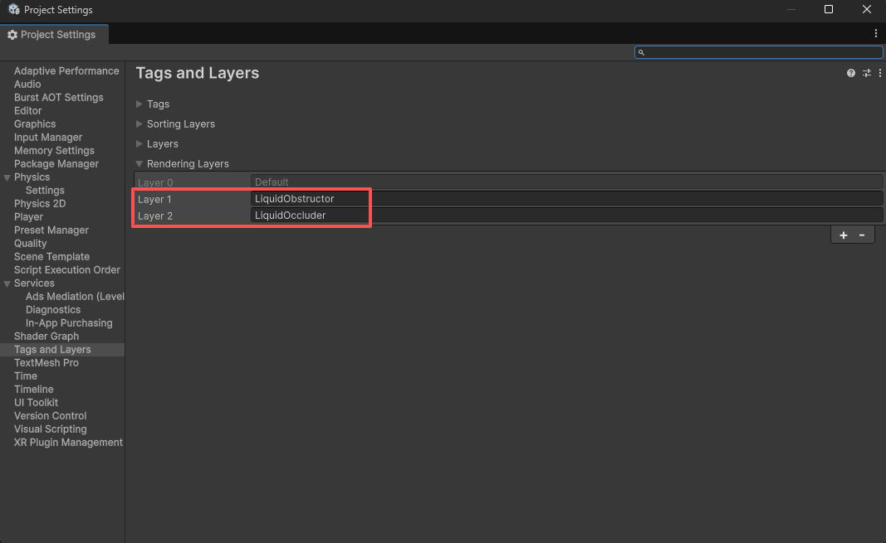
3. ブロック対象オブジェクトの Sprite Renderer コンポーネントで `Additional Settings -> Rendering Layer Mask` を見つけ、先ほど作成した `LiquidObstructor` レイヤーを選択します。
4. Liquid2DRenderer2D の Liquid2DFeature で `Obstructor Rendering Layer Mask` を見つけ、先ほど作成した `LiquidObstructor` レイヤーを選択します。

> [!TIP]
> GitHub のプロジェクトでは、正しい Rendering Layer Mask を設定済みです。  
> しかし、プラグインを自分のプロジェクトにインポートすると、これらの Rendering Layer は存在しません。  
> それでもデモシーンでは、ブロック対象が流体パーティクルをきちんとブロックしているのが分かります。これは元々正しい Rendering Layer Mask が設定されているためです。  
> エンジンのキャッシュと仕組みにより、それらは引き続き正常に動作します。しかしあなたのプロジェクトでは、これらの Rendering Layer は実際には存在しません。  
> デモシーンの Liquid2DRenderer2D の Liquid2DFeature では、Obstructor Rendering Layer Mask の設定が `Unnamed Layer 1` と表示されます。  
> 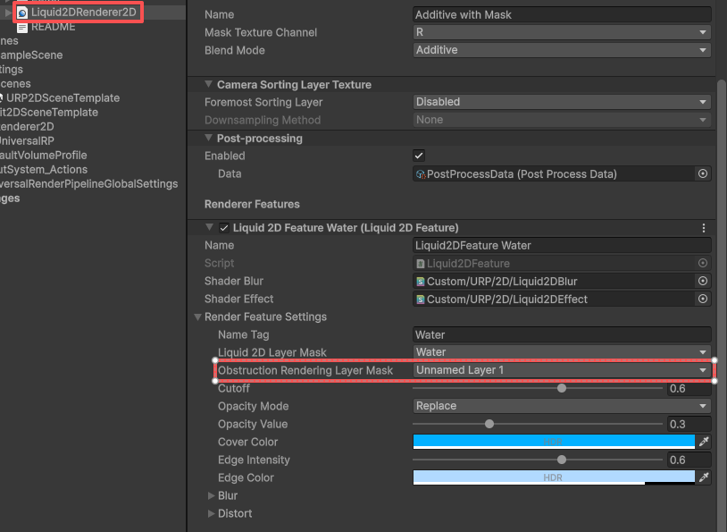

> [!IMPORTANT]
> ここでの Rendering Layer は**描画上の遮蔽順序**（流体をオブジェクトの前に描くか後ろに描くか）にのみ影響し、**流体の流れを実際にブロックするわけではありません**。  
> 物理的に流体の流れをブロックするのは [Liquid2DCollider コライダー](#liquid2dcollider-コライダー) です。両者は通常併用が必要です。コライダーで流体をせき止め、Rendering Layer でオブジェクトが正しく流体を遮蔽したり覆われたりするようにします。

#### ブロック
`ブロック`とは、描画上で流体パーティクルをせき止められるオブジェクトのことです。例えば、隔壁・パイプ・容器・地形などです。  
`Renderer Feature` の `ObstructorRenderingLayerMask` にブロック用のレイヤーを設定する必要があります。  
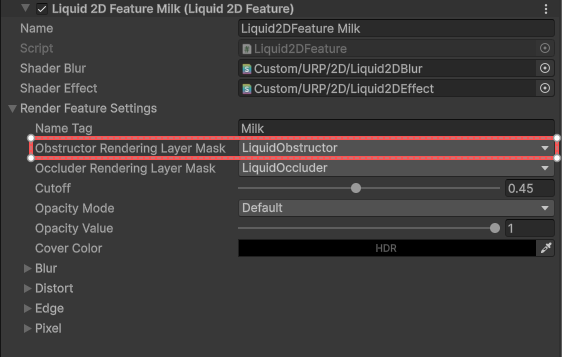

その後、シーン内で流体パーティクルをブロックする必要があるすべてのオブジェクトの `Sprite Renderer` コンポーネントの `Additional Settings` で `Rendering Layer Mask` を設定します。  
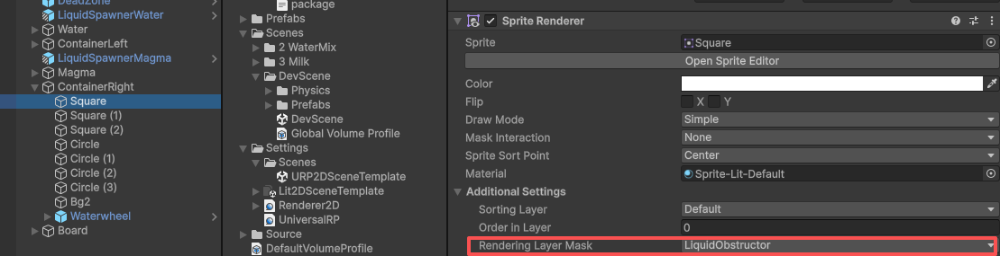

そうしないと、流体パーティクルがこれらのオブジェクトの上に重なってしまいます。  
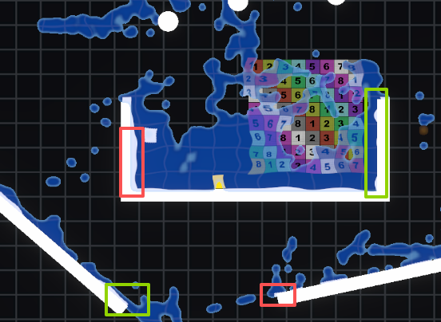

流体パーティクルの描画順序は `RenderPassEvent.AfterRenderingTransparents`、つまり透明オブジェクトの描画後だからです。  
そのため、ブロックレイヤーを正しく設定しないと、流体パーティクルは不透明オブジェクトと透明オブジェクトの上に描画されます。

#### 遮蔽
`遮蔽`とは、流体パーティクルの上に覆い被さるが、その流れはブロックしないオブジェクトのことです。例えば、ガラス瓶の正面や地形の正面などです。  
遮蔽の設定の流れはブロックと同様です。  
`Renderer Feature` の `OccluderRenderingLayerMask` に遮蔽用のレイヤーを設定する必要があります。  
その後、シーン内で流体パーティクルを遮蔽する必要があるすべてのオブジェクトの `Sprite Renderer` コンポーネントの `Additional Settings` で `Rendering Layer Mask` を設定します。  
ただし遮蔽オブジェクトは（物理設定によって）流体パーティクルの流れをブロックせず、流体パーティクルの上に覆い被さります。  
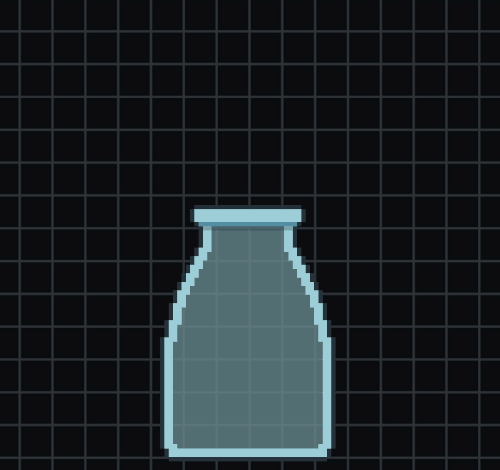

### Cover Color カバーカラー
`Cover Color` を設定し、その色の不透明度が 1（ここでの不透明度は覆い被せる強度を表します）の場合、この色が元の色を完全に覆います。

### Opacity 不透明度
`Opacity Mode` と `Opacity Value` パラメータを設定することで、流体全体の不透明度を制御できます。  
Default モードはパーティクル自体の透明度を変更しません。ぼかし後は内部の色がより不透明に、エッジがより透明に見えます。  
Multiply モードは不透明度とパーティクル自体の透明度を乗算します。  
Replace モードは不透明度をパーティクルに直接適用します。これはパーティクル自体の透明度やぼかし後の透明度も上書きします。  
カバーカラーと不透明度の設定を使うことで、均一な流体カラーが得られます。  
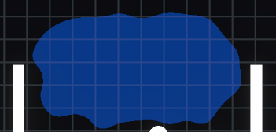

### Blur ぼかし
ぼかし効果はパーティクル間の融合をより自然にします。  
パーティクルテクスチャ自体の融合効果がすでに良好な場合は、ぼかしをオフにして性能を向上できます。  
ぼかしのイテレーション回数とオフセット量がぼかしの強さを決定します。イテレーション回数が多く、オフセットが小さいほど、より良いぼかし効果が得られます。  
SDF 方式ではなくぼかし方式を使っているため、パーティクル数は性能に影響しません。  
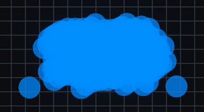
#### ぼかしと背景について
ぼかしの原理はピクセルをサンプリングして混ぜることなので、背景の色がぼかしの効果に影響し、最終的に流体のエッジが背景色に近く見えるようになります。  
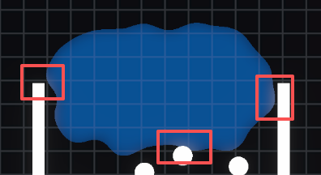

アルゴリズムでこの状況を緩和できますが、完全になくすことはできません。そのため、エッジの色を調整する `blurBgColor` と `blurBgColorIntensity` パラメータが用意されています。  
エッジカラーには流体全体に近い色を使い、強度を 0.5〜0.8 の間に設定すると、より自然な効果が得られます。  
`ignoreBgColor` パラメータをオンにして背景色の影響を無視することもできます（実際には背景色を完全には無視できません）。これは多少の性能コストを増やします。  
`Cover Color` を設定して背景色を完全に覆った場合、パーティクル自体の色とぼかしで生じる色が完全に覆われるため、流体パーティクルのエッジが背景色と融合することはなくなります。

### Distort 歪み
歪み効果によって流体の屈折をシミュレートします。流体が透明であれば、その背後の画面が歪む効果が見えます。  
流体が不透明な場合は、この効果をオフにして性能を向上できます。  
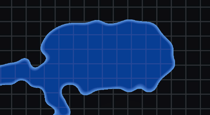

### Edge エッジ
`Edge Intensity` と `Edge Color` パラメータによって、流体のエッジの色と幅を制御できます。  
これにより流体のエッジを強調して目立たせたり、フレネルのエッジ効果をシミュレートしたり、発光するエッジを作ったりできます。  
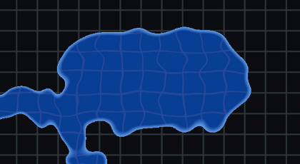

### Pixel ピクセル化
ピクセル化効果を有効にすると、流体パーティクルをピクセル化された表現にできます。  
これにより流体をピクセルアートスタイルのゲームに適用できます。  

#### PixelBg ピクセル化背景
ピクセル化背景を使うと、流体が覆っている領域もピクセル化され、スタイルがより統一されます。


## 💧 流体パーティクル設定ガイド
`Liquid2DParticleDescriptor` ディスクリプタは、ある種類の流体パーティクルのすべての属性を定義する、流体を構成する基本単位です。  
以下では主に重要な特徴やパラメータを説明します。より詳細なパラメータは Inspector パネルの Tooltip を直接確認してください。

### Sprite テクスチャ
流体パーティクルに適切な Sprite を設定することは非常に重要です。これが流体パーティクルの融合効果を決定し、最終的に流体全体の視覚効果を決定します。  
テクスチャのポイントは透明度の設計にあります。中心の透明度が高く、エッジの透明度が低い SDF 効果に似たテクスチャの使用をおすすめします。  
より柔らかいエッジが欲しい場合はガウスぼかしでテクスチャを処理できます。よりシャープなエッジが欲しい場合はハードエッジのテクスチャを使ってください。
#### テクスチャの透明度
パーティクル間の透明度の重ね合わせとクリッピングが、パーティクル融合を実現する鍵です。  
ぼかし効果と組み合わせることで、より自然な流体効果を実現できます。もちろんテクスチャ自体の融合がすでに良好なら、ぼかし効果をオフにして性能を向上することもできます。  
注意点として、パーティクルテクスチャは透明範囲がテクスチャ境界を超えるかどうかを気にしません。むしろ超えることでパーティクルがより早く融合できます。  
円形のテクスチャを使い、テクスチャの境界が透明であると仮定すると、パーティクルが接触してから融合し始めるまでに少し距離があります。  
しかしテクスチャの境界が 0.6 の透明度であれば、パーティクルは接触した時点で融合し始めます。  
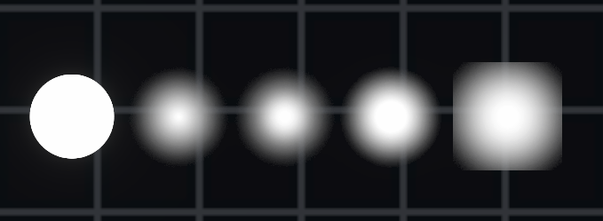

### パーティクルのサイズと描画
純粋データモデルでは、流体パーティクルは**もはや Unity のコライダーを使用しません**。パーティクルのサイズはディスクリプタ上の 2 つのパラメータで決まります。
- `Radius`：**物理半径**（ワールド単位）。パーティクル間の物理的な間隔・近傍探索範囲・堆積密度を決定し、SPH ソルブの基本スケールです。
- `RenderScale`：**描画倍率**。描画される表示直径 = `Radius × 2 × RenderScale`。

通常 `RenderScale` は物理半径よりはるかに大きく設定し（デフォルト 4）、隣接パーティクルのテクスチャを大きく重ねることで、滑らかな metaball 融合効果を得ます。  
表示サイズが小さすぎるとパーティクル間に隙間が見え、大きすぎると流体が「ねっとり」しすぎて見えます。Sprite テクスチャの透明度設計と組み合わせて融合の感触を調整してください。  
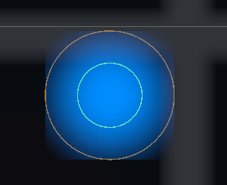

### Material 物理マテリアル
ディスクリプタ上の `Material`（`Liquid2DParticleMaterial`）は、この種類のパーティクルの物理表現を定義します。パラメータを差別化することで、水・マグマ・泡・砂などの異なる媒質をシミュレートできます。  
重要なパラメータ（さらなる詳細は Inspector の Tooltip を参照）：
- `Mass`：質量。力への応答と噴射初速に影響します（初速 = 力積 / 質量）。
- `Viscosity`：粘性。大きいほど粘り気が強く、流れが緩やかになります。水は低く、マグマは高い。
- `Cohesion`：内聚力 / 表面張力。大きいほど塊になりやすく、液滴を形成します。泡は高く、砂は 0。
- `Friction`：摩擦。コライダーと接触する際の接線方向の減衰。砂は高い値で安息角を作ります。
- `Restitution`：反発係数。コライダーと衝突する際の法線方向の反発の強さ。
- `GravityScale`：重力スケール。1 = 通常落下、0 = 浮遊、**負の値 = 上昇**（泡に適しています）。
- `Density`：流体の質量密度。**アルキメデスの浮力比較専用**です（物体の密度がこの値より小さければ浮きます）。堆積密度とは独立しています。
- `TargetDensityScale` / `NearPressureMultiplierScale`：それぞれグローバルな目標密度と近距離圧力をスケールし、単一種類のパーティクルの堆積の緩急と短距離の斥力を微調整します。

マテリアルには **Water（水）/ Lava（マグマ）/ Foam（泡）/ Sand（砂）** のプリセットが内蔵されており、出発点として微調整できます。水は低粘性・低張力、マグマは高粘性・高質量・高密度、泡は高張力・低重力で上昇すらし、砂は高摩擦・ゼロ張力です。  
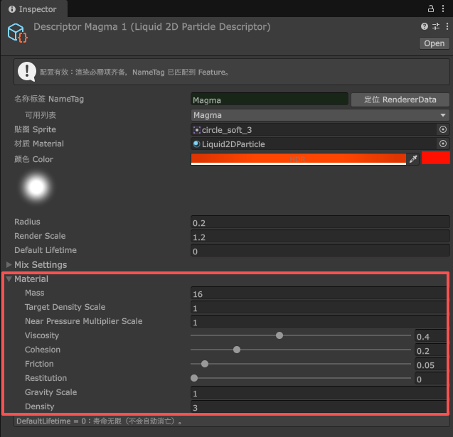

### Mix Colors 色の混合
ディスクリプタの `MixSettings` 内の `Mix Colors` を有効にすると、異なる色の流体パーティクル同士の色を混合できます。  
2 つのパーティクルの両方が `Mix Colors` を有効にしている場合にのみ、出会ったときに混合し、自身の色を変えます。  


設定に応じて、混合速度などの挙動を制御できます。
- `MixColorsSpeed`：混合速度（0 = 混合しない、1 = 瞬時に混合）。
- `MixColorsWithMovement`：パーティクルの運動に応じて混色を加速するか（運動が速いほど混色も速くなります）。
- `MixColorsWhenStationary`：静止時に混色するか。デフォルトはオフで、静止パーティクルは混色をスキップしてコストを節約します。静止時も混色が必要な場合は手動でオンにします。

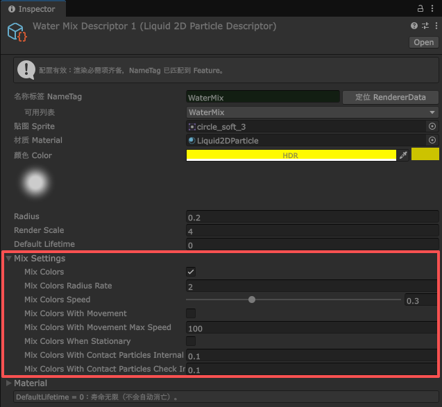

> 混色は**ソルバー内部の近傍クエリ**によって行われ（SPH が既に構築した空間構造を再利用して隣接パーティクル間で混色）、**もはや Unity 物理エンジンの接触コールバックに依存しません**。そのため `Reuse Collision Callbacks` を有効にする必要もありません。  
> 混色に使用するカラーアルゴリズムは `Liquid2DPhysicsConfig` の `ColorMixMode` でグローバルに制御され、3 種類に対応します。
> - `Oklab`（デフォルト）：知覚的に均一な色空間での混合。色の遷移が自然です。
> - `Ryb`：RYB 絵の具カラーホイールの混合（青 + 黄 = 緑）。実際の絵の具をシミュレートします。
> - `LinearRgb`：線形 RGB の算術平均（青 + 黄 = 灰）。

## 🧱 シーンの衝突とブロック
新システムは**自社開発のコライダー**を使い、シーンのオブジェクトが流体の流れをブロックできるようにし、従来の Unity `Collider2D` を置き換えます。

### Liquid2DCollider コライダー
隔壁・パイプ・容器・地形など、流体をブロックする必要があるオブジェクトには、対応するコライダーコンポーネントを追加するだけです（メニュー `Liquid 2D/Colliders/...`）。
- `Liquid2DBoxCollider`：矩形ボックス（回転 OBB に対応）。フィールド `size`。
- `Liquid2DCircleCollider`：円。フィールド `radius`。
- `Liquid2DCapsuleCollider`：カプセル。フィールド `length`、`radius`。
- `Liquid2DPolygonCollider`：ポリゴン。フィールド `points`、`closed`。`closed = true` で中実の凸ポリゴン、`closed = false` で両面の薄壁折れ線となり、複雑な地形に適しています。

コライダーのサイズはオブジェクトのスケールの影響を受け、オブジェクトを移動 / 回転するとコライダーも追従します。  
さらに `Liquid2DEdgeCollider` / `Liquid2DCustomCollider` / `Liquid2DMeshCollider` なども用意されており、Unity の `EdgeCollider2D` / `CustomCollider2D` などの既存コライダー形状をブリッジできます。  
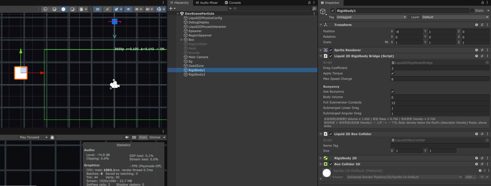

> [!TIP]
> 各コライダーには任意の `nameTag` があります。空欄のときは**すべて**のパーティクルに作用し、入力すると**そのタグに一致するパーティクルグループのみ**をブロックします。  
> これにより「特定の流体は特定のオブジェクトを通り抜けられる」といった効果を作れます。

### コライダーの相互作用モード（Push / Submerge）
各コライダーは `Collider Mode` フィールドで 2 つの相互作用モードを切り替えられ、流体パーティクルが接したときの挙動を決定します。
- **Push（押し出し、デフォルト）**：コライダーは流体パーティクルを体の外へ押し出し続け、パーティクルは**貫通できません**。隔壁・パイプ・流体容器・地形など、流体を厳密にせき止める必要があるオブジェクトに適しており、従来のデフォルト挙動でもあります。
- **Submerge（水没）**：流体パーティクルはコライダー内部を**通過**できます。コライダーが静止しているときは流体が自然にコライダーを「覆い」、運動しているときは速度に応じて周囲の流体を排除して水しぶきや波紋を生み出しつつ、**双方向カップリングを保持**します（コライダーは依然として流体の抗力と浮力を受けます）。視覚的には流体がコライダーを「水没 / 被覆」する表現となり、水に浮く / 沈む小物に適し、より自然な入水の見え方が得られます。  


Submerge モードでは、流体との相互作用を微調整するための専用パラメータ群が追加で用意されています（このモードでのみ有効）。
- `Submerge Coupling`：変位結合強度（0~1、デフォルト 0.25）。運動中、コライダーは覆っている流体を**自身の速度の逆方向**へ押し、水が物体を回り込んで回流するようにします（物体と水の「位置交換」。上昇する物体では前方の水が下 / 外へ退き、後方が埋め戻します）。コライダーの速度で 0 から漸入するため、**静止時は流体を乱しません**。純散逸で安定し、0.15~0.4 を推奨します。
- `Submerge Splash Strength`：飛沫強度（デフォルト 1、0 = 飛沫なし）。下記の閾値を超えると、コライダーの速度の逆方向へ**非線形に**追加速度を注入して飛沫を生成します（例：水面へ下方向に叩きつけると水が上へ跳ねる）。高速衝突の瞬間のみ有効で、浮遊の安定性には影響しません。
- `Submerge Splash Threshold`：飛沫開始の速度閾値（ワールド単位/秒、デフォルト 4）。コライダーの速度がこの値を超えたときのみ飛沫が発生します——「浮体への力場による擾乱」の速度より**高く**、「自由落下による水面衝突」の速度より**低く**設定します。速度結合の漸入の参照速度でもあります。
- `Submerge Splash Range`：飛沫の漸入速度区間（ワールド単位/秒、デフォルト 6）。飛沫強度が 0 から最大まで増加する速度範囲で、小さいほど早く最強の飛沫に達します。
- `Submerge Fluid Density Threshold`：施力する流体密度の閾値（静止密度に対する比率、デフォルト 0.4、0 = フィルタなし）。SPH 密度がこの値を超える流体パーティクルのみが変位 / 飛沫力を受けます——密な水体 / 水面は密度が高く通常どおり力を受け、空中の孤立した飛沫は密度が低く力を受けないため、空中の物体が近くの水滴を弾き飛ばすのを防ぎます。自由水面は約 0.5、孤立水滴は約 0.1~0.2。0.35~0.45 にすると水面の飛沫は通しつつ孤立水滴を遮れます。

> [!TIP]
> Submerge モードは通常 [Liquid2DRigidbodyBridge ブリッジコンポーネント](#liquid2drigidbodybridge-ブリッジコンポーネント) と併用し、物体が水面に沈む / 浮き上がる、水流に押し流されるといった、より自然な双方向の相互作用を得られます。

## 🤝 双方向カップリング（流体 ↔ 剛体）
流体はシーンのオブジェクトにブロックされるだけでなく、逆にシーン内の `Rigidbody2D` を押すこともでき、押し流しや浮遊などの双方向インタラクション効果を実現します。

### Liquid2DRigidbodyBridge ブリッジコンポーネント
`Rigidbody2D` を持つオブジェクトに、`Liquid2DCollider`（任意の形状）と `Liquid2DRigidbodyBridge` コンポーネントを追加すると、そのコライダーは**動的コライダー**となり、流体が加える反作用力を剛体にブリッジします。  


主なパラメータ：
- **押し流し（相対速度抵抗）**
  - `dragCoefficient`：抵抗係数。大きいほど流体に押し流されやすくなります。流体が静止しているときこの力は ≈0 で、理由なく物体を押すことはありません。
  - `applyTorque`：接触重心の位置に力を加えてトルクを生み出します（物体が流体とともに転がるようにします）。
  - `maxSpeedChange`：1 ステップあたりの速度変化の上限。瞬間的に過度に加速されるのを防ぎます。
- **浮力（アルキメデスの原理）**
  - `useBuoyancy`：浮力を有効にします。
  - `bodyVolume`：物体の体積（2D 面積）。0 のときは子コライダーの形状から自動的に計算されます。
  - `fullSubmersionContacts`：「完全に水没」とみなすために必要な接触パーティクル数。
  - `submergedLinearDrag` / `submergedAngularDrag`：水没時の線形 / 角度の減衰。

> [!TIP]
> 浮力は物体の**下方**で接触する流体パーティクルのみをカウントし、上部の流体が軽い物体を「跳ね飛ばす」のを防ぎます。  
> 物体の密度（`Rigidbody2D` の質量 / 体積）と流体マテリアルの `Density` の比較で、浮くか沈むかが決まります。

## 🧲 フォースフィールド
フォースフィールドは範囲内の流体パーティクルに追加の力を加え、アトラクター・リペラー・渦・吸水口などの効果を作るのに使います。  
`Liquid 2D/Physics/Force Fields/Liquid 2D Radial Force Field` コンポーネント（`Liquid2DRadialForceField`）を追加すると、オブジェクトの位置を中心に継続的に作用します。  


主なパラメータ：
- `radius`：フォースフィールドの作用半径。
- `strength`：フォースフィールドの強度（> 0 で吸引、< 0 で反発）。
- `swirlStrength`：接線方向の渦の強度（> 0 で反時計回り、< 0 で時計回り）。
- `velocityDamping`：範囲内の速度減衰係数。
- `gravityAttenuation`：フォースフィールド内の重力減衰（パーティクルがフォースフィールドに支配されやすくなります）。
- `falloff` / `forceMode`：距離による力の減衰指数とモード（`Falloff` / `Constant`）。
- `nameTag`：空欄ですべてのパーティクルに作用し、入力すると一致するパーティクルグループのみに作用します。

> [!TIP]
> プラグインには `Liquid2DMouseInteractor` も用意されています。これはフォースフィールドのサブクラスで、マウスでリアルタイムに流体を吸引 / 反発でき、デバッグやインタラクションに便利です。

## 💀 デッドゾーンと境界
`Liquid 2D/Gameplay/Liquid 2D Dead Zone` コンポーネント（`Liquid2DDeadZone`）を使い、シーン内に領域を区切って**パーティクルを回収**します。これは従来の Unity 物理トリガー方式を置き換え、画面外に流れ出たパーティクルが無限に堆積するのを防ぎます。  
主なパラメータ：
- `shape`：領域の形状（Box / Circle / Capsule / Polygon）。`size` / `radius` / `length` / `points` と組み合わせます。
- `boundsMode`：`false` で領域に**入った**パーティクルを破棄、`true` で領域から**出た**（領域外の）パーティクルを破棄し、アクティブな境界として使えます。
- `nameTag`：タグに一致するパーティクルグループのみを回収します。

さらに `Liquid2DBounds` コライダーも用意されており、流体を一定の範囲内に閉じ込める閉じた境界として使えます。

## ⛲ パーティクルスポナー設定ガイド
`Liquid2DSpawner` パーティクルスポナーは、流体パーティクルを生成するために使い、水道管や噴水のようなものです。  
以下では主に重要な特徴やパラメータを説明します。より詳細なパラメータは Inspector パネルの Tooltip を直接確認してください。

### 噴射の制御
パラメータによって、噴射するパーティクルの流量と勢いを制御できます。
- `flowRate` / `flowRateFactor`：流量（パーティクル / 秒）とその調整係数。
- `ejectForce` / `ejectForceFactor` / `ejectForceRandomRange`：噴射力の大きさ・係数・ランダム範囲。
- `nozzleWidth`：ノズル幅。バッチ生成時は幅内に層状に均一に分布します。
- `sizeRandomRange`：パーティクルサイズのランダム範囲。

#### 生成パーティクルディスクリプタリスト
`Liquid Particles` で複数の `Liquid2DParticleConfig` を設定できます。各項目は 1 つの**ディスクリプタ**、**ウェイト**、任意の**ライフタイム**の上書きを含みます。パーティクルを生成するたびに、ウェイトに応じてディスクリプタがランダムに選ばれます。  
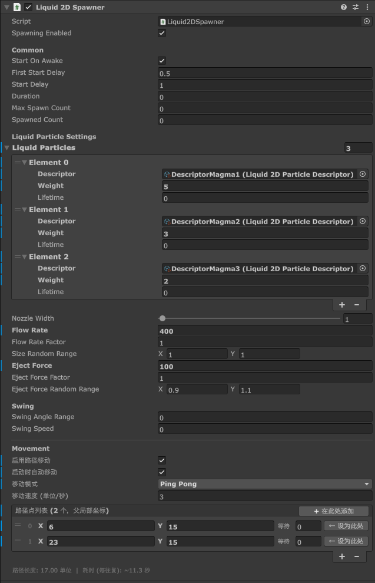

これにより、より多様なパーティクルを使ってマグマなどのより複雑な流体をシミュレートできます。それらは通常、不均一な赤・オレンジ・黄のパーティクルの混合です。  


マグマの設定のコツについて、ここでは `Cutoff` を 0.14 に設定し、流体が透明度の低い部分をより多く保持するようにしています。  
そして `Distort` 効果を有効にします。こうすると、マグマ流体のエッジの透明に近い部分で背景が屈折して歪み、湯気が立ち上るような効果が見られます。

### 揺れとパス移動
移動する水道管 / 噴水をシミュレートするため、スポナーはノズルの揺れとパスに沿った移動に対応します。
- `swingAngleRange` / `swingSpeed`：噴射方向の揺れの角度範囲と速度。
- `moveEnabled` / `moveMode`（`Once` / `Loop` / `PingPong`）/ `moveSpeed` / `waypoints`：スポナーを一連のウェイポイントに沿って移動させます。


## 🚀 パフォーマンス最適化ガイド（物理）
以下の対策は、さまざまな規模で最適な性能を得るのに役立ちます。

### Liquid2DPhysicsConfig コンポーネント
`Liquid2DPhysicsConfig` コンポーネント（メニュー `Liquid 2D/Systems/Liquid 2D Physics Config`）は、ソルバーのグローバルパラメータ・ソルブモード・パーティクル上限・物理ステップなどを一元管理し、`Awake` 時に自動的に適用します。シーン内の任意の常駐オブジェクトに取り付けるだけです。  
より詳細なパラメータの説明は、各フィールドの Inspector Tooltip を参照してください。

### CPU / GPU ソルブモードの選択
コンポーネントの `Mode` フィールドがソルブのプラットフォームを決定します。**明確な理由がない限り、常に GPU モードの使用をおすすめします。**
- **GPU モード（デフォルト、推奨）**：Compute Shader で駆動し、パーティクルデータを GPU に常駐させます。CPU モードよりはるかに高性能で、数万規模のパーティクルを簡単に扱えます。プラットフォームが Compute Shader をサポートしない場合は自動的に CPU モードへフォールバックします。
- **CPU モード**：Job System + Burst で駆動します。Compute Shader を本当に使えないプラットフォームや、CPU 側のパーティクルデータを確実に読み取る必要があるデバッグシナリオに適しています。

> [!WARNING]
> GPU モードではパーティクルデータが GPU に常駐し、**CPU 側のデータはデフォルトで古い**ため、`GetPosition` / `GetVelocity` / デバッグ Gizmos など CPU データに基づく機能は信頼できません。  
> GPU モードでこれらのデータを読み取る必要がどうしてもある場合は `GpuReadbackToStore` を有効にできますが、これは**同期的な GPU→CPU の停止**を伴いコストが大きいため、**本番環境ではオフのままにしてください**。  
> 描画（Renderer Feature）は GPU バッファを直接読み取るため、この影響を受けません。

### パーティクル数と主要なチューニング
- **`MaxParticlesPerTag`（nameTag ごとの生存上限）**：GPU モードではパーティクル数にほぼ上限がありません（VRAM の制約のみ）。ターゲット機種でのテストで性能が不足すると感じたときにのみ、このパラメータで生存数を制限することを検討します（0 は無制限）。上限を超えると、そのグループ内の最も古いパーティクルが自動的に回収されます。逃げ出したパーティクルを回収してシーンをきれいに保つために、[デッドゾーン](#-デッドゾーンと境界) との併用をおすすめします。
- **`Substeps`（サブステップ数）**：各固定物理ステップを細分するサブステップ数。大きいほど安定します（高速 / 高圧でも貫通や爆発が起きにくい）が、コストも大きくなります。
- **`MaxSpeed`（最大速度）**：パーティクルの速度上限を制限し、圧力の爆発による速度の暴走を防ぎます（0 = 無制限、噴射力の 3〜5 倍を推奨）。
- **`SmoothingRadius (H)`、`TargetDensity`、`PressureMultiplier`、`NearPressureMultiplier`、`ViscosityStrength` などのグローバル SPH パラメータ**：流体全体の圧縮性・弾性・粘り気を決定し、安定性とコストに影響します。詳細は Tooltip を参照してください。
- **`overrideFixedTimestep` / `fixedTimestep`**：物理周波数（`Time.fixedDeltaTime`）を一括で上書きできます。物理周波数を下げると毎秒のソルブ回数が減りますが、物理の滑らかさと高速時の安定性が低下します。


## 📋 ToDo リスト
- **物理システム**
  - 流体パーティクル間のより豊かな相互作用：粘性・張力・温度などをさらにシミュレートし、石油・蜂蜜・煙などより多くの媒質を表現する。
  - より多くのフォースフィールドとインタラクションの種類（方向性フォースフィールド、風、爆発の衝撃波など）。
- **描画 / ツール**
  - GPU モードと CPU モードの間で、混色などの細部のさらなる整合。
  - より充実したエディタのデバッグ・可視化ツール。
