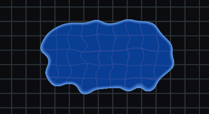
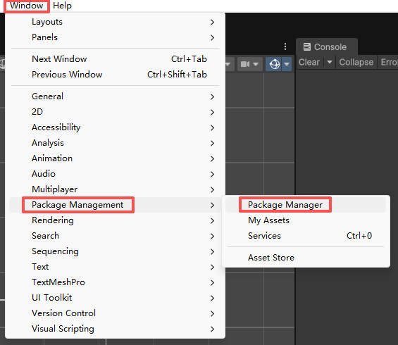
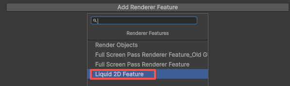
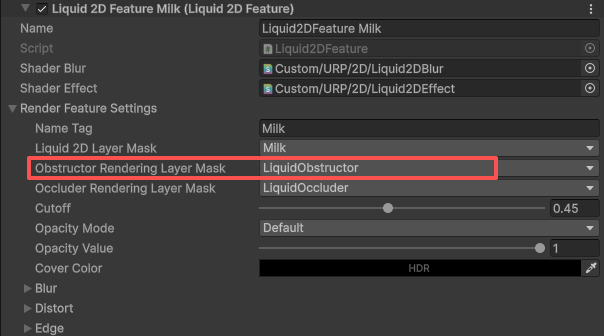
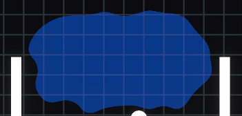
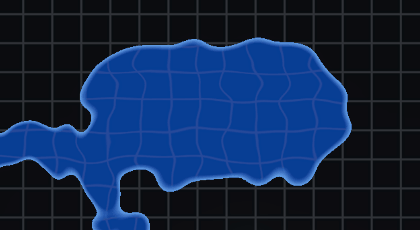
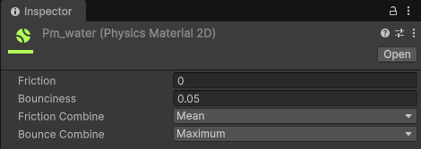
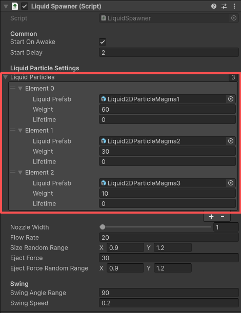

<p align="center">
  
  
  
  
</p>

<p align="center">
  🌍
  <a href="./README.md">中文</a> |
  <a href="./README_EN.md">English</a> |
  日本語
</p>

<p align="center">
  📥
  <a href="#upmを使用">インストール</a> |
  <a href="#パッケージをダウンロード">ダウンロード</a>
</p>

# Liquid 2D Simulation - 2D流体シミュレーション
Liquid 2D Simulation は `Unity` 向けの2D流体シミュレーションシステムです。\
インストール後すぐに使用可能で、リアルな物理流体表現を迅速に実現できます。\
豊富な設定パラメータにより、さまざまな質感の流体を自由に作成できます。

## 📜 目次
- [紹介](#紹介)
  - [プロジェクトの特徴](#プロジェクトの特徴)
- [💻 システム要件](#-システム要件)
- [🌳 ブランチ](#-ブランチ)
- [🌱 クイックスタート](#-クイックスタート)
  - [1. プラグインのインストール](#1-プラグインのインストール)
  - [2. Renderer Featureの追加](#2-renderer-featureの追加)
  - [3. 流体粒子プレハブの作成](#3-流体粒子プレハブの作成)
  - [4. パーティクルスポナーの作成](#4-パーティクルスポナーの作成)
- [🌊 Renderer Feature 設定ガイド](#-renderer-feature-設定ガイド)
  - [Rendering Layerの設定](#rendering-layerの設定)
  - [Cover Color カバー色](#cover-color-カバー色)
  - [Opacity 不透明度](#opacity-不透明度)
  - [Blur ブラー](#blur-ブラー)
  - [Distort 歪み](#distort-歪み)
  - [Edge エッジ](#edge-エッジ)
  - [Pixel ピクセル化](#pixel-ピクセル化)
- [💧 流体粒子設定ガイド](#-流体粒子設定ガイド)
  - [Sprite テクスチャ](#sprite-テクスチャ)
  - [Collider](#collider)
  - [Rigidbody 2D](#rigidbody-2d)
  - [Mix Colors 色の混合](#mix-colors-色の混合)
- [⛲ 流体スポナー設定ガイド](#-流体スポナー設定ガイド)
  - [スポーンの制御](#スポーンの制御)
- [📋 Todoリスト](#-todo-リスト)


## 紹介
この流体粒子システムを使用することで、水、マグマ、石油など、さまざまな質感の2D流体シミュレーションを素早く実装できます。\
プロジェクトは流体粒子を通じて2D流体効果をシミュレーションし、効率的に大量の粒子を生成することをサポートし、モバイルプラットフォームで使用できます。ただし、過度のリジッドボディは依然としてパフォーマンスの問題となります。\
`Render Graph` フレームワークを使用することで、メインカメラ1つだけで、`GPU Instance` 方式で流体粒子をレンダリングします。\
従来の、個別のカメラでRender Targetにレンダリングする方式と比較して、レンダリング効率が大幅に向上しました。\
レンダリング方式はSDFの融合効果に似ており、流体の自然な効果を表現します。\
実際のプロセスでは、パーティクルテクスチャのアルファ値の重ね合わせとクリッピングによってパーティクル融合効果を実現します。厳密なSDF手法と比較して、この方式はパフォーマンスと効果のより良いバランスを達成し、パーティクル数の増加に伴ってパフォーマンスが低下することもありません。\


### プロジェクトの特徴
| 特徴                              | 説明                                                                                          |
| --------------------------------- | -------------------------------------------------------------------------------------------- |
| URP 2D                            | URP2Dベースのプロジェクト。                                                                    |
| Render Graph                      | 新しいRender Graphフレームワークを使用してレンダリングし、パフォーマンスが大幅に向上。              |
| GPU Instance                      | GPU Instance方式でパーティクルをレンダリングし、一度に大量のパーティクルをレンダリング可能。         |
| ランタイムボリューム変更            | ランタイムでVolumeを通じて流体粒子のレンダリング効果を変更することをサポート。                      |
| 物理パーティクルシミュレーション     | リジッドボディを通じて流体粒子の物理効果をシミュレーションし、より自然な表現を実現。                 |
| パーティクル物理計算 ⚠️TODO         | 高性能なパーティクル物理アルゴリズムにより、数千のパーティクルでもスムーズに処理できます。           |


## 💻 システム要件
- `Unity 6000.2` 以降のバージョン
- 2022.3 ブランチは `Unity 2022.3` をサポートしていますが、このブランチの更新はメインブランチより遅くなります
- URP 2D レンダリングパイプライン。Unity 6 バージョンでは Render Graph フレームワークを使用してレンダリングを行います
- シェーダーと互換性のあるプラットフォーム


## 🌳 ブランチ
- **main** - メインブランチ、Unity 6 ベース。
- **2022.3** - Unity 2022.3 バージョンブランチ。古いバージョンでこのシステムを使用する場合は、このブランチを確認してください。更新はメインブランチより遅くなります。


## 🌱 クイックスタート
好みの方法でプラグインをインストールし、デモシーンを直接確認してこのシステムの使用方法を学ぶことができます。\
または、以下の手順に従って段階的に操作してください。
### 1. プラグインのインストール
#### UPMを使用
```
https://github.com/blurfeng/unity-water-liquid-2d-simulation.git?path=Assets/Plugins/Liquid2DSimulation
```
UPMを通じてプラグインをプロジェクトにインストールします。デモシーンが必要な場合は、以下の方法でインポートしてください。
1. `Window -> Package Manager` を開きます。\


2. 左上の `+` をクリックし、`Install package from git URL...` を選択します。\


3. 上記のURLを貼り付け、`Install` ボタンをクリックします。\


4. インストール完了後、`Packages` に `Liquid2DSimulation` パッケージが表示されます。Samplesフォルダをインポートしてデモシーンを確認できます。\


5. Samplesフォルダをインポートした後、`Assets/Samples/Liquid 2D Simulation/./Samples` ディレクトリでデモシーンを確認できます。\


#### パッケージをダウンロード
インストールパッケージを使用してプラグインをプロジェクトにインストールします。\
[Releases](https://github.com/blurfeng/unity-water-liquid-2d-simulation/releases) ページから最新のインストールパッケージをダウンロードします。\
次に、パッケージをプロジェクトにインポートします。

> [!TIP]
> プラグインには、デモシーンを含むSamplesフォルダが含まれています。ここから直接このシステムの使用方法を学び始めることができます。\
> または、以下の手順に従って段階的に流体粒子システムをシーンに追加してください。\


### 2. Renderer Featureの追加
デモシーンではすでにRenderer Featureが追加されています。\
独自のシーンでこのシステムを使用したい場合は、現在のRenderer 2D DataにLiquid2D Featureを追加する必要があります。\


### 3. 流体粒子プレハブの作成
`./Liquid2DSimulation/Runtime/Resources/Prefabs/` ディレクトリで流体粒子プレハブ `Liquid2DParticle` を見つけることができます。\
このプレハブからバリアントプレハブを作成し、マテリアルとパラメータを変更して希望の流体粒子を作成することをお勧めします。\
独自の流体粒子プレハブを直接作成し、`Liquid2DParticle` コンポーネント、`Circle Collider 2D` コンポーネント、`Rigidbody 2D` コンポーネントを追加することもできます。\


流体粒子の動作を調整するために `Liquid2DParticle` コンポーネントのパラメータを設定する必要があります。Sprite テクスチャ、マテリアル、色、流体レイヤーなどが含まれます。\
プラグインの `./Liquid2DSimulation/Runtime/Resources/Materials/` と `./Liquid2DSimulation/Runtime/Resources/Textures` ディレクトリにマテリアルとテクスチャが提供されており、直接使用できます。

### 4. パーティクルスポナーの作成
`./Liquid2DSimulation/Runtime/Resources/Prefabs/` ディレクトリでパーティクルスポナープレハブ `LiquidSpawner` を見つけることができます。\
UPM経由でインストールした場合、プリファブは`Packages/Liquid 2D Simulation/Runtime/Resources/Prefabs/`ディレクトリに配置されます。\
このプレハブからバリアントプレハブを作成し、パラメータを変更して希望のパーティクルスポナーを作成することをお勧めします。\
独自のパーティクルスポナープレハブを直接作成し、`Liquid2DSpawner` コンポーネントを追加することもできます。\


> [!TIP]
> ここまでで、流体粒子システムは動作準備が整いました。\
> ただし、流体粒子がシーン内のオブジェクトによって正しく遮断および隠蔽されるように、遮断と隠蔽レイヤーを設定する必要があります。


## 🌊 Renderer Feature 設定ガイド
`Liquid2DFeature` Renderer Featureは流体粒子をレンダリングし、最終的に流体効果を実現するために使用されます。\
以下では主に重要な機能やパラメータについて説明します。より詳細なパラメータは、Inspectorパネルのツールチップで直接確認できます。

### Rendering Layerの設定
Liquid FeatureはRendering Layerを使用して、流体粒子を遮断または隠蔽できるオブジェクトを区別します。
#### 障害物Rendering Layerの追加
1. `Edit -> Project Settings -> Tags and Layers` を開きます。
2. `Rendering Layers` に新しいレイヤー（例：`LiquidObstructor`）を追加します。

3. 障害物のSprite Rendererコンポーネントで、`Additional Settings -> Rendering Layer Mask` を見つけ、作成した `LiquidObstructor` レイヤーを選択します。
4. Liquid2DRenderer2DのLiquid2DFeatureで、`Obstructor Rendering Layer Mask` を見つけ、作成した `LiquidObstructor` レイヤーを選択します。

> [!TIP]
> GitHubのプロジェクトでは、正しいRendering Layer Maskを設定しています。\
> しかし、プラグインをプロジェクトにインポートする際、プロジェクトにはこれらのRendering Layerが存在しません。\
> しかし、デモシーンでは障害物が流体粒子をうまく遮断していることがわかります。これは、元々正しいRendering Layer Maskが設定されていたためです。\
> エンジンのキャッシュとメカニズムにより、これらは正常に機能し続けることができます。しかし、あなたのプロジェクトでは、これらのRendering Layerは実際には存在しません。\
> デモシーンのLiquid2DRenderer2DのLiquid2DFeatureで、Obstructor Rendering Layer Maskの設定は `Unnamed Layer 1` として表示されます。\
> 

#### 遮断
`遮断`とは、バリア、パイプ、コンテナ、地形など、流体粒子の流れを妨げることができるオブジェクトを指します。\
`Renderer Feature`の`ObstructorRenderingLayerMask`で遮断に使用するレイヤーを設定する必要があります。\


次に、シーン内の流体粒子を遮断する必要があるすべてのオブジェクトの`Sprite Renderer`コンポーネントの`Additional Settings`で`Rendering Layer Mask`を設定します。\


そうしないと、流体粒子がこれらのオブジェクトの上に重なって表示されることがわかります。\


流体粒子のレンダリング順序は`RenderPassEvent.AfterRenderingTransparents`で、透明オブジェクトがレンダリングされた後です。\
そのため、遮断レイヤーを正しく設定しない場合、流体粒子は不透明および透明オブジェクトの上にレンダリングされます。

#### 隠蔽
`隠蔽`とは、流体粒子の上に覆うことができるが、流体粒子の流れを遮断しないオブジェクト（ガラス瓶の前面、地形の前面など）を指します。\
隠蔽の設定プロセスは遮断と似ています。\
`Renderer Feature`の`OccluderRenderingLayerMask`で隠蔽に使用するレイヤーを設定する必要があります。\
次に、シーン内の流体粒子を隠蔽する必要があるすべてのオブジェクトの`Sprite Renderer`コンポーネントの`Additional Settings`で`Rendering Layer Mask`を設定します。\
ただし、隠蔽オブジェクトは流体粒子の流れを遮断せず（物理設定を通じて）、流体粒子の上に覆います。\


### Cover Color カバー色
`Cover Color` を設定し、この色のアルファが1（ここでアルファはカバー強度を表す）の場合、この色は元の色を完全にカバーします。

### Opacity 不透明度
`Opacity Mode` と `Opacity Value` パラメータを設定することで、流体の全体的な不透明度を制御できます。\
Defaultモードはパーティクル自体の透明度を変更しません。ブラー後、内部の色はより不透明に見え、エッジはより透明になります。\
Multiplyモードは不透明度をパーティクル自体の透明度と乗算します。\
Replaceモードは不透明度を直接パーティクルに適用します。これはパーティクル自体の透明度とブラー後の透明度も上書きします。\
カバー色と不透明度設定を使用することで、均一な流体色を得ることができます。\


### Blur ブラー
ブラー効果により、パーティクル間の融合がより自然になります。\
パーティクルテクスチャ自体がすでに良い融合効果を持っている場合は、ブラーをオフにしてパフォーマンスを向上させることができます。\
ブラーの反復回数とオフセットがブラーの強度を決定します。より多い反復回数とより小さいオフセットでより良いブラー効果を得ることができます。\
SDF方式ではなくブラー方式を使用するため、パーティクル数はパフォーマンスに影響しません。\

#### ブラーと背景について
ブラーの原理はピクセルをサンプリングして混合することであるため、背景色がブラー効果に影響し、最終的に流体のエッジが背景色に近く見えます。\


アルゴリズムでこの状況を軽減することはできますが、完全に除去することはできません。そのため、エッジの色を調整するために `blurBgColor` と `blurBgColorIntensity` パラメータが提供されています。\
パーティクル全体に近い色をエッジ色として使用し、強度を0.5-0.8の間に設定することで、より自然な効果を得ることをお勧めします。\
`ignoreBgColor` パラメータを有効にして背景色の影響を無視することもできます（実際には背景色を完全に無視することはできません）が、これによりパフォーマンスオーバーヘッドが追加されます。\
`Cover Color` を設定して背景色を完全にカバーすると、パーティクル自体の色とブラーによって生成された色が完全にカバーされるため、流体粒子のエッジが背景色と融合する状況はなくなります。

### Distort 歪み
歪み効果によって流体の屈折をシミュレーションします。流体が透明な場合、背景の歪んだ効果を見ることができます。\
流体が不透明な場合は、この効果をオフにしてパフォーマンスを向上させることができます。\


### Edge エッジ
`Edge Intensity` と `Edge Color` パラメータによって、流体エッジの色と幅を制御できます。\
これにより流体のエッジを強調し、より明確にし、フレネルエッジ効果をシミュレーションしたり、光るエッジを作成したりできます。\


### Pixel ピクセル化
ピクセル化効果を有効にすることで、流体粒子にピクセル化された効果を表示させることができます。\
これにより、流体をピクセルスタイルのゲームに適用できます。\

#### PixelBg ピクセル化背景
ピクセル化背景により、流体でカバーされる領域もピクセル化効果を表示し、スタイルをより統一できます。


## 💧 流体粒子設定ガイド
`Liquid2DParticle` 流体粒子は流体を構成する基本単位です。\
以下では主に重要な機能やパラメータについて説明します。より詳細なパラメータは、Inspectorパネルのツールチップで直接確認できます。

### Sprite テクスチャ
流体粒子に適切なSpriteを設定することは非常に重要で、これが流体粒子の融合効果を決定し、最終的に流体全体の視覚効果を決定します。\
テクスチャの重要なポイントはアルファ値の設計です。SDF効果に似たテクスチャの使用をお勧めします。中央のアルファ値が高く、エッジのアルファ値が低いものです。\
より柔らかいエッジが必要な場合は、ガウシアンブラーでテクスチャを処理できます。よりシャープなエッジが必要な場合は、ハードエッジのテクスチャを使用できます。
#### テクスチャアルファ
パーティクル間のアルファ値の重ね合わせとクリッピングが、パーティクル融合を実現する鍵です。\
ブラー効果と組み合わせることで、より自然な流体効果を実現できます。もちろん、テクスチャ自体の融合がすでに良い場合は、ブラー効果をオフにしてパフォーマンスを向上させることもできます。\
パーティクルテクスチャは、透明範囲がテクスチャの境界を超えているかどうかを気にしないことに注意してください。実際に超えることで、パーティクルがより早く融合できます。\
円形のテクスチャを使用し、テクスチャの境界が透明だとします。パーティクルが接触したときに、融合を開始するまでに距離があります。\
しかし、テクスチャの境界が0.6のアルファ値を持つとします。パーティクルが接触したときに融合を開始します。\


### Collider
コライダーとリジッドボディは、流体粒子の物理効果を実現する鍵です。円形のコライダーの使用をお勧めします。これにより、流体粒子の物理効果をより良く表現できます。\
一般的に、コライダーのサイズはテクスチャのサイズより小さくする必要があります。これにより、表現上で流体粒子がより良く融合でき、そうでなければパーティクル間の隙間が見えます。\


### Rigidbody 2D
Unityの物理システムを使用して流体粒子の物理効果をシミュレーションします。\
リジッドボディの質量、線形抵抗、重力スケールなどのパラメータはすべて流体粒子の動作に影響します。\
これらのパラメータを調整することで、水、マグマ、石油などの異なるタイプの流体をシミュレーションできます。\
物理マテリアルも流体粒子の動作に影響します。摩擦と弾性などのパラメータを調整することで、異なる流体効果をシミュレーションできます。\



### Mix Colors 色の混合
`Mix Colors` を有効にすることで、異なる色の流体粒子間で色を混合させることができます。\
両方のパーティクルが `Mix Colors` を有効にしている必要があり、接触時に混合して自身の色を変化させます。\


設定に基づいて、混合の速度と範囲を制御できます。\


## ⛲ 流体スポナー設定ガイド
`LiquidSpawner` 流体スポナーは流体粒子を生成するために使用され、パイプや噴水のようなものです。\
以下では主に重要な機能やパラメータについて説明します。より詳細なパラメータは、Inspectorパネルのツールチップで直接確認できます。

### スポーンの制御
パラメータによって、スポーンされるパーティクルの流量と強度を制御できます。
#### スポーンパーティクルプレハブリスト
複数のパーティクルプレハブを設定できます。パーティクルが生成されるたびに、重みに基づいてランダムにプレハブが選択されます。\


これにより、より多くの異なるパーティクルを使用してより複雑な流体をシミュレーションできます。例えば、マグマ。これらは通常、赤、オレンジ、黄色の不均一な混合パーティクルです。\


マグマの設定技巧について、ここでは `Cutoff` を0.14に設定し、流体がより多くの低透明度部分を保持するようにします。\
そして `Distort` 効果を有効にします。これにより、マグマ流体の端の透明に近い部分の背景が屈折歪曲され、湯気が立ち上るような効果を見ることができます。


## 📋 Todo リスト
- **物理システム**
  - 最適化：大量のパーティクルを生成する場合、Unity の物理システムはすぐにパフォーマンスのボトルネックになる可能性があります。物理システムを最適化し、流体物理を手動で計算するか、DOTS システムを使用してパフォーマンスを向上させる必要があります。
  - 流体粒子間の相互物理作用：粘性と張力などの物理効果をシミュレーションし、石油、蜂蜜、泡などの異なるタイプの流体を表現します。
