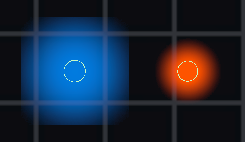

# Liquid 2D Simulation

Liquid 2D Simulation 是一款用于 Unity 的2D流体模拟系统。\
Liquid 2D Simulation is a 2D fluid simulation system designed for Unity.\
Liquid 2D Simulation は、Unity 向けに設計された 2D 流体シミュレーションシステムです。


## 🌍 语言/Language/言語
- ***阅读中文文档 > [中文](README.md)***
- ***Read this document in > [English](README_en.md)***
- ***日本語のドキュメントを読む > [日本語](README_ja.md)***


## 📜 Table of Contents

- [Introduction](#introduction)
  - [Project Features](#project-features)
- [💻 System Requirements](#-system-requirements)
- [🌳 Branches](#-branches)
- [🌱 Quick Start](#-quick-start)
  - [1. Install Plugin](#1-install-plugin)
  - [2. Configure Rendering Layer](#2-configure-rendering-layer)
  - [3. Add Renderer Feature](#3-add-renderer-feature)
  - [4. Create Fluid Particle Prefab](#4-create-fluid-particle-prefab)
  - [5. Create Particle Spawner](#5-create-particle-spawner)
- [Renderer Feature Settings Guide](#renderer-feature-settings-guide)
  - [Cover Color](#cover-color)
  - [Opacity](#opacity)
  - [Blur](#blur)
  - [Distort](#distort)
  - [Edge](#edge)
  - [Pixel](#pixel)
- [Fluid Particle Settings Guide](#fluid-particle-settings-guide)
  - [Sprite Texture](#sprite-texture)
  - [Collider](#collider)
  - [Rigidbody 2D](#rigidbody-2d)
- [Particle Spawner Settings Guide](#particle-spawner-settings-guide)
  - [Control Spawning](#control-spawning)
- [Todo List](#todo-list)


## Introduction
Using this fluid particle system, you can quickly implement 2D fluid simulation, including water, magma, oil and other fluids with different textures.\
The project simulates 2D fluid effects through fluid particles and supports efficiently generating large numbers of particles, suitable for mobile platforms. However, too many rigidbodies remain a performance issue.\
By using the `Render Graph` framework, only one main camera is needed, and fluid particles are rendered using `GPU Instance`.\
Compared to traditional methods of rendering to Render Target with separate cameras, rendering efficiency is greatly improved.\
The rendering method is similar to SDF fusion effects, showing natural fluid effects.\
In the actual process, particle fusion effects are achieved through alpha blending and clipping of particle textures. Compared to strict SDF methods, this approach achieves a better balance between performance and effects, and performance doesn't decrease as particle count increases.\


### Project Features
| Feature                           | Description                                                                                          |
| --------------------------------- | ---------------------------------------------------------------------------------------------------- |
| URP2D                             | Project based on URP2D.                                                                              |
| Render Graph                      | Uses the new Render Graph framework for rendering with significantly improved performance.           |
| GPU Instance                      | Uses GPU Instance to render particles, can render many particles at once, supporting more particles. |
| Runtime Volume Modification       | Supports modifying fluid particle rendering effects through Volume at runtime.                       |
| Physical Particle Simulation      | Simulates physical effects of fluid particles through rigidbodies for more natural performance.      |


## 💻 System Requirements
- Unity 6000.2 or newer. (Or use the Unity 2022.3 branch version)
- URP2D rendering pipeline.
- Uses Renderer Graph framework for rendering.
- Platform compatible with shaders.


## 🌳 Branches
- **main** - Main branch, based on Unity 6.
- **2022.3** - Unity 2022.3 version branch. If you need to use this system on older versions, check this branch. Updates will be slower than the main branch.


## 🌱 Quick Start
Install the plugin in your preferred way, then you can directly check the demo scene to learn how to use this system.\
Or follow the steps below step by step.
### 1. Install Plugin
#### Using UPM
```
https://github.com/blurfeng/unity-water-liquid-2d-simulation.git?path=Assets/Plugins/Liquid2DSimulation
```
Install the plugin to your project through UPM. If you need demo scenes, import using the method below.
1. Open `Window -> Package Manager`.\


2. Click the `+` in the top left corner and select `Install package from git URL...`.\


3. Paste the URL above and click the `Install` button.\


4. After installation completes, you'll see the `Liquid2DSimulation` package in `Packages`. You can import the Samples folder to view demo scenes.\


5. After importing the Samples folder, you can see demo scenes in the `Assets/Samples/Liquid 2D Simulation/./Samples` directory.\


#### Package
Install the plugin to your project using the installation package.
Download the latest installation package from the [Releases](https://github.com/blurfeng/unity-water-liquid-2d-simulation/releases) page.\
Then import the package into your project.\
The plugin includes a Samples folder with demo scenes. You can start learning how to use this system directly from here.\


### 2. Configure Rendering Layer
Liquid Feature uses Rendering Layer to distinguish which objects can block fluid particles, such as barriers, pipes, containers, terrain, etc.\
You need to configure the layers used for blocking in the Obstruction Rendering Layer Mask and assign the same layers to objects.\
Otherwise, you'll find that fluid particles will overlay on top of these objects because the rendering order of fluid particles is RenderPassEvent.AfterRenderingTransparents.


But in the demo scene, you'll find that obstructions block fluid particles well. This is because the correct Rendering Layer Mask was already configured.\
Due to engine caching and mechanisms, they can still work normally. But in your project, these Rendering Layers don't actually exist.\
In the demo scene's Liquid2DRenderer2D's Liquid2DFeature, the Obstruction Rendering Layer Mask configuration shows as `Unnamed Layer 1`.\


On the obstruction's Sprite Renderer in the scene, the Additional Settings' Rendering Layer Mask is configured as `Everything`.\


#### Add Obstruction Rendering Layer
1. Open `Edit -> Project Settings -> Tags and Layers`.
2. Add a new layer in `Rendering Layers`, such as `LiquidObstruction`.

3. In your obstruction's Sprite Renderer component, find `Additional Settings -> Rendering Layer Mask` and select the `LiquidObstruction` layer you just created.
4. In Liquid2DRenderer2D's Liquid2DFeature, find `Obstruction Rendering Layer Mask` and select the `LiquidObstruction` layer you just created.

This way, fluid particles will be correctly blocked by obstructions.

### 3. Add Renderer Feature
The demo scene already has the Renderer Feature added.\
If you want to use this system in your own scene, you need to add Liquid2D Feature to the current Renderer 2D Data.\


### 4. Create Fluid Particle Prefab
You can find the fluid particle prefab `Liquid2DParticle` in the `./Liquid2DSimulation/Runtime/Resources/Prefabs/` directory.\
It's recommended to create a variant prefab from this prefab, then modify materials and parameters to create the fluid particles you want.\
You can also directly create a fluid particle prefab yourself, then add `Liquid2DParticle` component, `Circle Collider 2D` component and `Rigidbody 2D` component.\


You need to configure the parameters of the `Liquid2DParticle` component to adjust the behavior of fluid particles. Including Sprite texture, material, color and fluid layer, etc.\
Materials and textures are provided in the plugin's `./Liquid2DSimulation/Runtime/Resources/Materials/` and `./Liquid2DSimulation/Runtime/Resources/Textures` directories that you can use directly.

### 5. Create Particle Spawner
You can find the particle spawner prefab `LiquidSpawner` in the `./Liquid2DSimulation/Runtime/Resources/Prefabs/` directory.\
It's recommended to create a variant prefab from this prefab, then modify parameters to create the particle spawner you want.\
You can also directly create a particle spawner prefab yourself, then add the `Liquid2DSpawner` component.\


## Renderer Feature Settings Guide
Renderer Feature is used to render fluid particles and ultimately achieve fluid effects.\
The following mainly explains important features or parameters. More detailed parameters can be viewed directly in the Inspector panel tooltips.

### Cover Color
If you set `Cover Color` and this color's alpha is 1 (here alpha represents coverage intensity), then this color will completely cover the original color.

### Opacity
By setting `Opacity Mode` and `Opacity Value` parameters, you can control the overall opacity of the fluid.\
Default mode doesn't change the particle's own opacity. After blurring, the internal color looks more opaque and edges become more transparent.\
Multiply mode multiplies the opacity with the particle's own opacity.\
Replace mode directly applies the opacity to particles. This also overrides the particle's own opacity and post-blur opacity.\
Using cover color and opacity settings, you can get uniform fluid color.\


### Blur
Blur effects make particle fusion more natural.\
If your particle texture already has good fusion effects, you can turn off blur to improve performance.\
The blur iteration count and offset determine blur intensity. More iterations and smaller offsets can achieve better blur effects.\
Since blur is used instead of SDF, particle count doesn't affect performance.\

#### About Blur and Background
Because blur works by sampling and blending pixels, the background color affects the blur effect, making fluid edges look close to the background color.\


Algorithms can reduce this situation but can't completely eliminate it. Therefore, `blurBgColor` and `blurBgColorIntensity` parameters are provided to adjust edge color.\
It's recommended to use colors close to the particle's overall color as edge color, with intensity set between 0.5-0.8 for more natural effects.\
You can also enable the `ignoreBgColor` parameter to ignore background color influence (actually can't completely ignore background color), which adds some performance overhead.\
If you set `Cover Color` and completely cover the background color, there won't be fluid particle edge blending with background color, because the particle's own color and blur-generated color will be completely covered.

### Distort
Simulates fluid refraction through distortion effects. If the fluid is transparent, you can see the distorted effect of the background.\
If the fluid is opaque, you can turn off this effect to improve performance.\


### Edge
Through `Edge Intensity` and `Edge Color` parameters, you can control the color and width of fluid edges.\
This can emphasize fluid edges, make them more obvious, simulate Fresnel edge effects, or create glowing edges.\


### Pixel
By enabling the pixelation effect, you can make fluid particles show pixelated effects.\
This can make fluids suitable for pixel-style games.\

#### PixelBg
Pixelated background can make the area covered by fluid also show pixelated effects, making the style more unified.


## Fluid Particle Settings Guide
Fluid particles are the basic units that compose fluids.\
The following mainly explains important features or parameters. More detailed parameters can be viewed directly in the Inspector panel tooltips.

### Sprite Texture
Configuring appropriate Sprite for fluid particles is very important, it determines the fusion effect of fluid particles and ultimately determines the overall visual effect of the fluid.\
The key to the texture is the alpha design. It's recommended to use textures with SDF-like effects, high alpha in the center and low alpha at edges.\
If you want softer edges, you can use Gaussian blur to process textures. If you want sharper edges, you can use hard-edge textures.
#### Texture Alpha
Alpha blending and clipping between particles is the key to achieving particle fusion.\
Combined with blur effects, more natural fluid effects can be achieved. Of course, if the texture's own fusion is already good, you can also turn off blur effects to improve performance.\
Note that particle textures don't care if the transparent range exceeds the texture boundaries - exceeding actually allows particles to fuse earlier.\
Suppose you use a circular texture where the texture boundary is transparent, then particles will have a distance before they start fusing when they touch.\
But suppose the texture boundary has 0.6 alpha, then particles will start fusing when they touch.\


### Collider
Colliders and rigidbodies are key to achieving physical effects of fluid particles. It's recommended to use circular colliders, which better represent the physical effects of fluid particles.\
Generally, the collider size needs to be smaller than the texture size, so that fluid particles can fuse better visually, otherwise you'll see gaps between particles.\


### Rigidbody 2D
Uses Unity's physics system to simulate physical effects of fluid particles.\
The rigidbody's mass, linear drag, gravity scale and other parameters all affect the behavior of fluid particles.\
You can adjust these parameters to simulate different types of fluids, such as water, magma, oil, etc.\
Physics materials also affect the behavior of fluid particles. By adjusting friction and bounciness parameters, different fluid effects can be simulated.\


## Particle Spawner Settings Guide
Particle spawner is used to generate fluid particles, like a pipe or fountain.\
The following mainly explains important features or parameters. More detailed parameters can be viewed directly in the Inspector panel tooltips.

### Control Spawning
Through parameters you can control the flow rate and intensity of spawned particles.
#### Spawn Particle Prefab List
You can configure multiple particle prefabs. Each time a particle is generated, a prefab is randomly selected based on weight.\


This allows you to use more different particles to simulate more complex fluids, such as magma. They are usually non-uniform mixtures of red, orange and yellow particles.\


For magma configuration tips, I set the `Cutoff` to 0.14 here, so the fluid retains more parts with low transparency.\
Then enable the `Distort` effect. This way you'll see the background near the transparent parts of the magma fluid edges being refracted and distorted, creating an effect similar to rising heat.\


## Todo List
- **Fluid Particles**
  - Color mixing: Simulate mixing of different colored fusible fluid colors, such as yellow and blue mixing to become green.
- **Physics System**
  - Optimization: Currently when generating large numbers of particles, Unity's physics system becomes slow. Need to find better solutions, such as using DOTS physics system.
  - Inter-fluid particle physical interactions: Through simulating physical effects like viscosity and tension, represent different types of fluids, such as oil, honey, foam, etc.